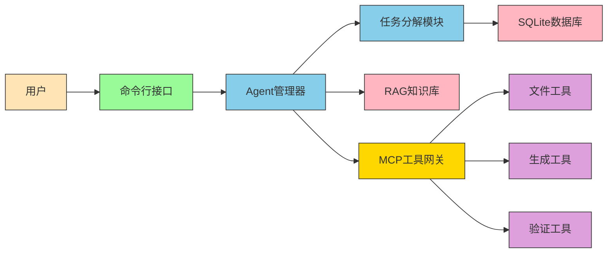

# 系统架构图

## 整体架构

## 架构说明

### 1. 用户层 (User)
- 提供自然语言输入接口
- 接收系统输出的结构化结果
- 支持交互式信息补充

### 2. 命令行接口 (CLI)
- 自然语言需求解析
- 任务列表展示与确认
- 子任务执行控制
- 结果展示与反馈

### 3. Agent管理器 (Agent Manager)
- 任务分解与重组
- 子任务状态机管理
- LLM交互协调
- 执行流程控制

### 4. 任务分解模块 (Task Decomposer)
- 基于LLM的需求分析
- 结构化任务清单生成
- 任务依赖关系管理
- 执行计划制定

### 5. MCP工具网关 (MCP Tool Gateway)
- 工具注册与发现
- 协议解析与执行
- 安全权限控制
- 结果结构化返回

### 6. RAG知识库 (RAG Knowledge Base)
- 知识文档存储
- 内容分块与向量化
- 相似性检索
- 结果重排序

### 7. 本地数据管理 (Local Data Management)
- 任务历史持久化
- 子任务状态跟踪
- 数据库备份恢复
- 结构化数据存储