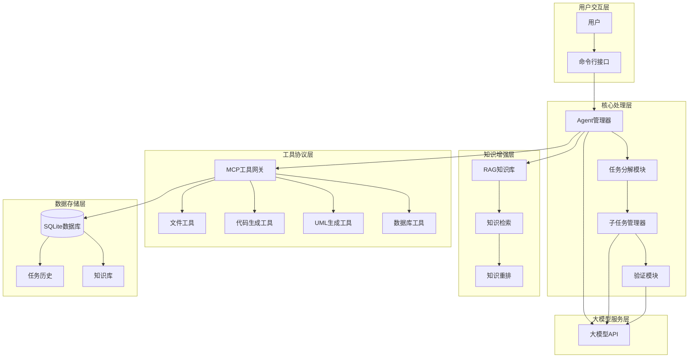

# AI Agent Flow 系统架构图

## 系统概述

AI Agent Flow 系统是一个基于多智能体协作的AI驱动工程实现闭环系统，通过自然语言需求解析、任务拆解、工具调用和结果验证的全流程管理，实现用户需求的自动化处理。

## 整体架构

## 架构组件说明

### 1. 用户交互层
- **用户**：系统的主要使用者，提供自然语言需求输入
- **命令行接口**：提供用户与系统的交互界面，支持命令输入和结果展示

### 2. 核心处理层
- **Agent管理器**：基于CrewAI框架实现的多智能体管理核心
- **任务分解模块**：将用户需求分解为结构化子任务
- **子任务管理器**：管理子任务状态，包括信息补充循环和执行流程
- **验证模块**：对子任务执行结果进行验证

### 3. 知识增强层
- **RAG知识库**：存储技术文档、代码范例和工具手册
- **知识检索**：基于用户查询检索相关知识
- **知识重排**：对检索结果进行相关性重排

### 4. 工具协议层
- **MCP工具网关**：基于MCP SDK实现的工具协议层
- **文件工具**：提供文件操作能力，包括文件列表、读取和写入
- **代码生成工具**：生成可执行代码
- **UML生成工具**：生成类图和序列图
- **数据库工具**：提供SQLite数据库操作接口

### 5. 数据存储层
- **SQLite数据库**：本地数据持久化存储
- **任务历史**：存储用户输入、子任务和结果
- **知识库**：存储RAG系统使用的知识数据

### 6. 大模型服务层
- **大模型API**：提供OpenAI兼容的API接口，用于自然语言处理和内容生成

## 数据流向

1. **需求输入**：用户通过命令行接口输入自然语言需求
2. **任务分解**：Agent管理器调用大模型API将需求分解为结构化子任务
3. **子任务执行**：子任务管理器依次执行每个子任务，在执行过程中可能需要信息补充
4. **工具调用**：根据子任务需求，通过MCP工具网关调用相应的工具
5. **知识检索**：在需要时，通过RAG知识库检索相关知识
6. **结果验证**：验证模块对子任务执行结果进行验证
7. **数据存储**：将任务历史和结果存储到SQLite数据库
8. **结果输出**：将最终结果返回给用户

## 技术栈

| 组件 | 技术实现 |
|------|----------|
| **Agent流程引擎** | CrewAI框架 | 
| **工具协议层** | MCP SDK (FastMCP服务端 + MCP客户端) | 
| **大模型交互** | OpenAI兼容API |
| **知识增强** | RAG检索系统 | 
| **本地存储** | SQLite3数据库 | 
| **命令行交互** | Python argparse |
