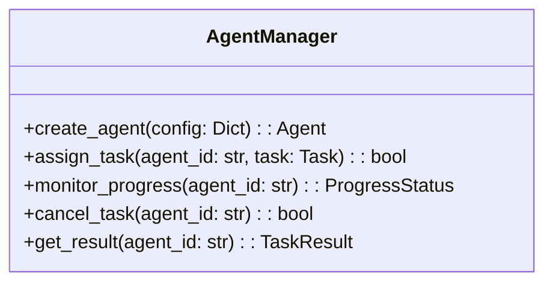
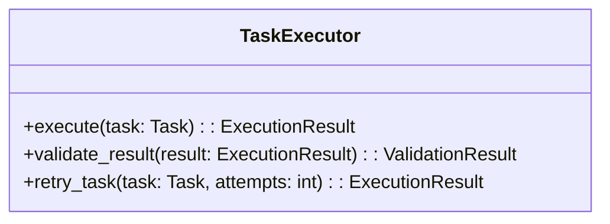
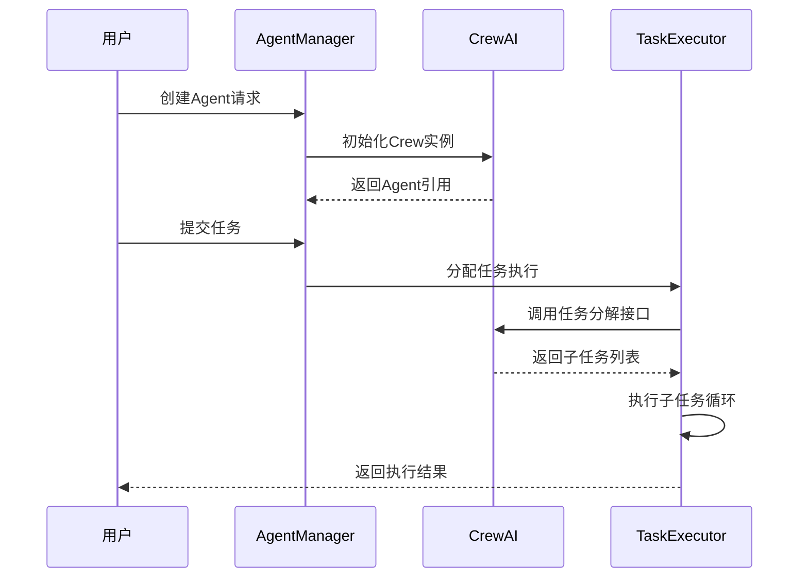

# Agent管理模块详细设计文档

## 1. 模块职责
- 负责Agent生命周期管理（创建、执行、销毁）
- 实现基于CrewAI的任务分解与调度
- 维护Agent状态与上下文管理
- 处理子任务执行流程控制

## 2. 核心类设计

### 2.1 AgentManager


### 2.2 TaskExecutor


## 3. 流程设计


## 4. 集成实现
```python
# agent/manager.py
from crewai import Crew, Agent, Task

class AgentManager:
    def __init__(self):
        self.agents = {}
        self.crewai_client = Crew()

    def create_agent(self, config):
        agent = Agent(
            role=config['role'],
            goal=config['goal'],
            tools=config.get('tools', [])
        )
        agent_id = str(uuid4())
        self.agents[agent_id] = agent
        return agent_id

    def execute_task(self, agent_id, task_config):
        agent = self.agents.get(agent_id)
        if not agent:
            raise ValueError("Agent not found")
            
        task = Task(
            description=task_config['description'],
            expected_output=task_config['expected_output']
        )
        
        crew = self.crewai_client.create_crew(
            agents=[agent],
            tasks=[task]
        )
        
        return crew.kickoff()
```

## 5. 扩展性设计
- 支持动态加载CrewAI扩展模块
- 提供任务钩子接口用于结果验证
- 实现多Agent协作模式
- 集成结果缓存机制