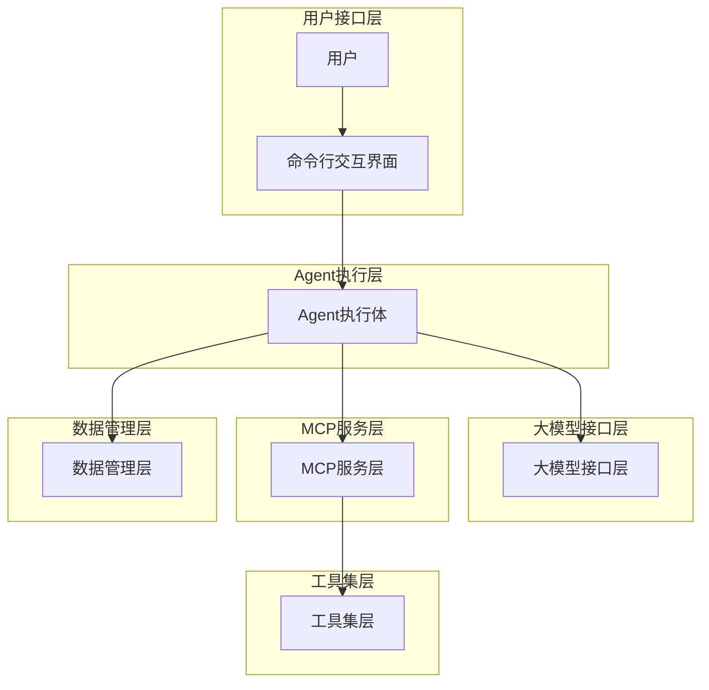
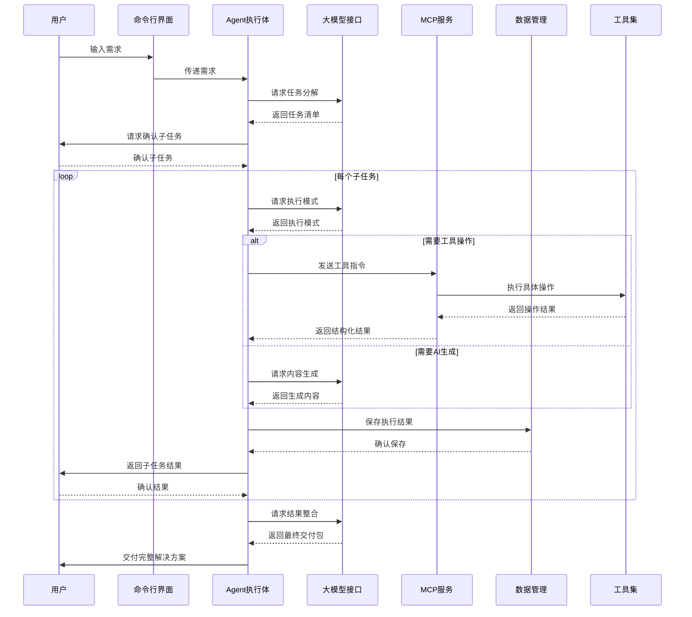
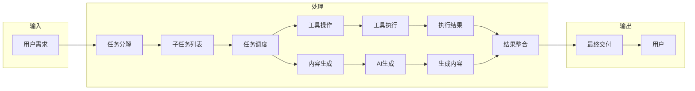
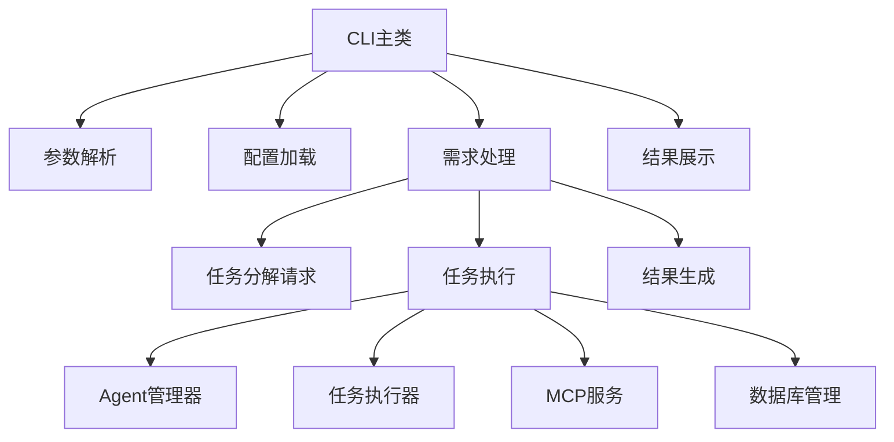
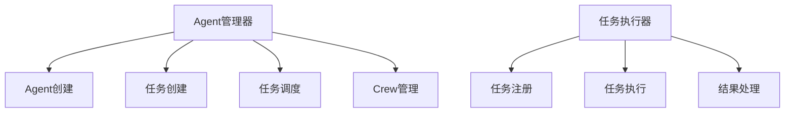
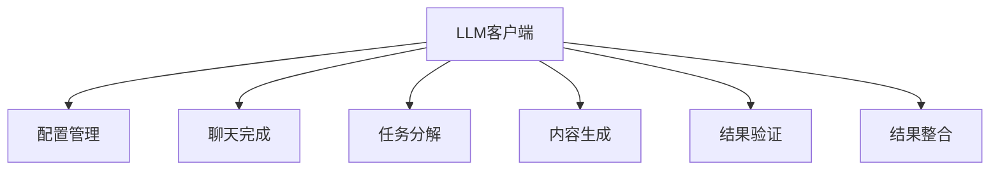
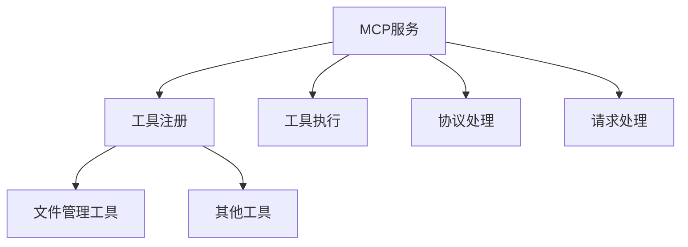

# 系统架构图

## 1. 整体架构



## 2. 模块间交互关系



## 3. 数据流图



## 4. 各模块详细架构

### 4.1 命令行交互界面



### 4.2 Agent执行层



### 4.3 大模型接口层



### 4.4 MCP服务层



### 4.5 数据管理层

```mermaid
graph TD
    A[数据库管理器] --> B[连接管理]
    A --> C[任务管理]
    A --> D[结果管理]
    A --> E[配置管理]
    
    C --> F[任务创建]
    C --> G[任务查询]
    C --> H[任务更新]
    
    D --> I[结果保存]
    D --> J[结果查询]
    D --> K[结果更新]
    
    E --> L[配置设置]
    E --> M[配置查询]
    E --> N[配置删除]