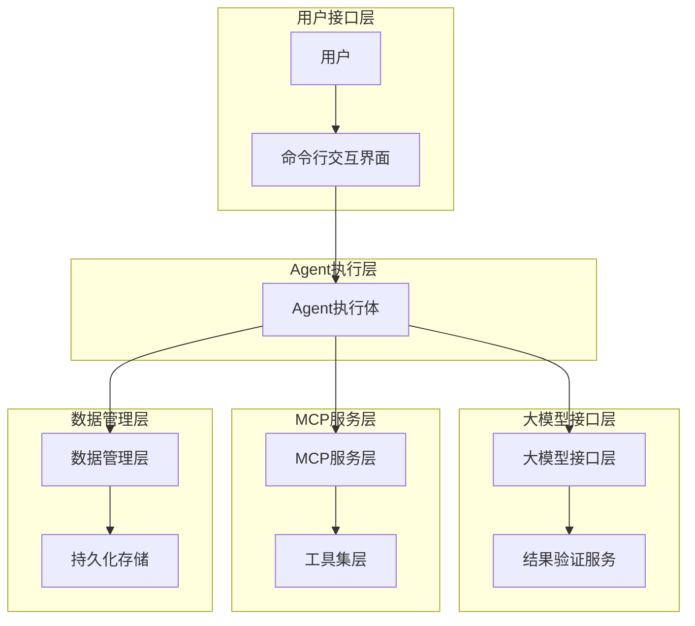
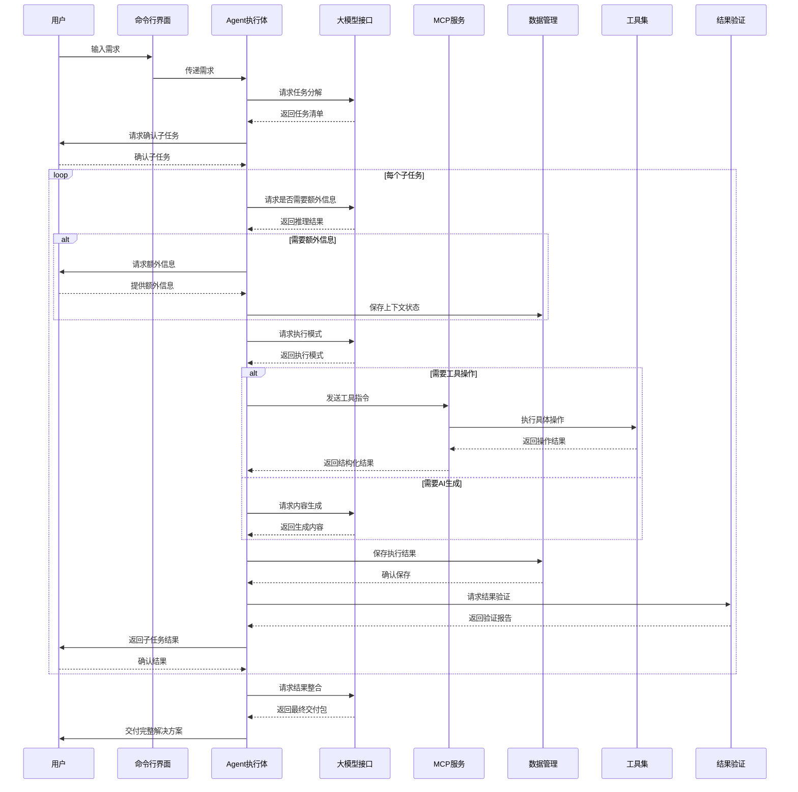
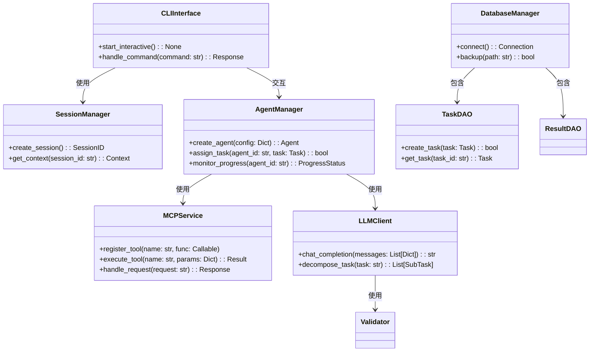

# 系统架构图更新

## 1. 更新后的整体架构


## 2. 更新的模块交互关系


## 3. 更新的类图


## 4. 更新的数据流图
```mermaid
graph LR
    A[用户需求] --> B[任务分解]
    B --> C[子任务列表]
    C --> D[任务调度]
    
    D --> E[工具操作]
    D --> F[内容生成]
    
    E --> G[工具执行]
    G --> H[执行结果]
    
    F --> I[AI生成]
    I --> J[生成内容]
    
    H --> K[结果整合]
    J --> K[结果整合]
    
    K --> L[最终交付]
    L --> M[用户]
    
    subgraph 输入
        A
    end
    
    subgraph 处理
        B
        C
        D
        E
        F
        G
        H
        I
        J
        K
    end
    
    subgraph 输出
        L
        M
    end
    
    DataFlow[持久化存储] -->|读写| Processing
    Processing -->|状态更新| DataFlow