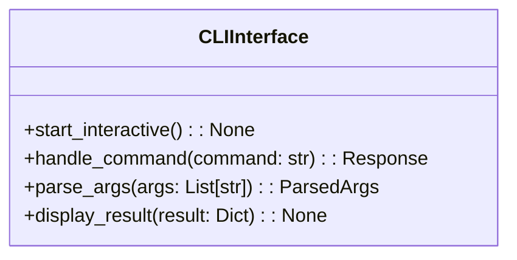
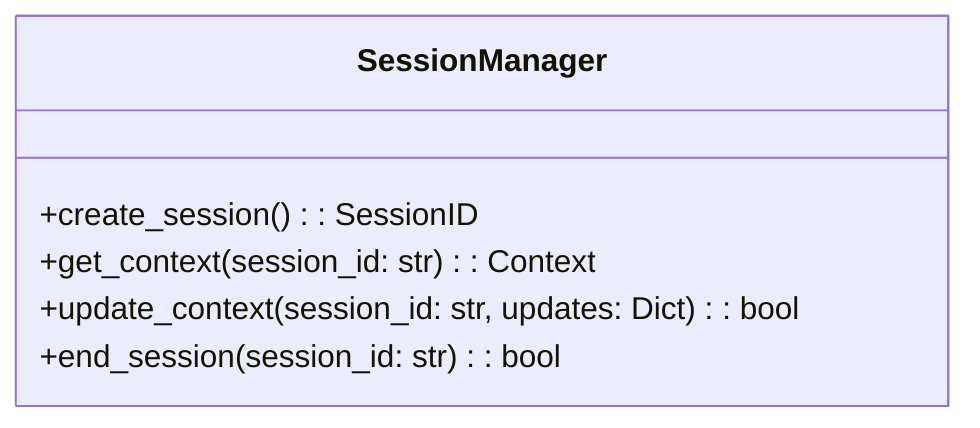
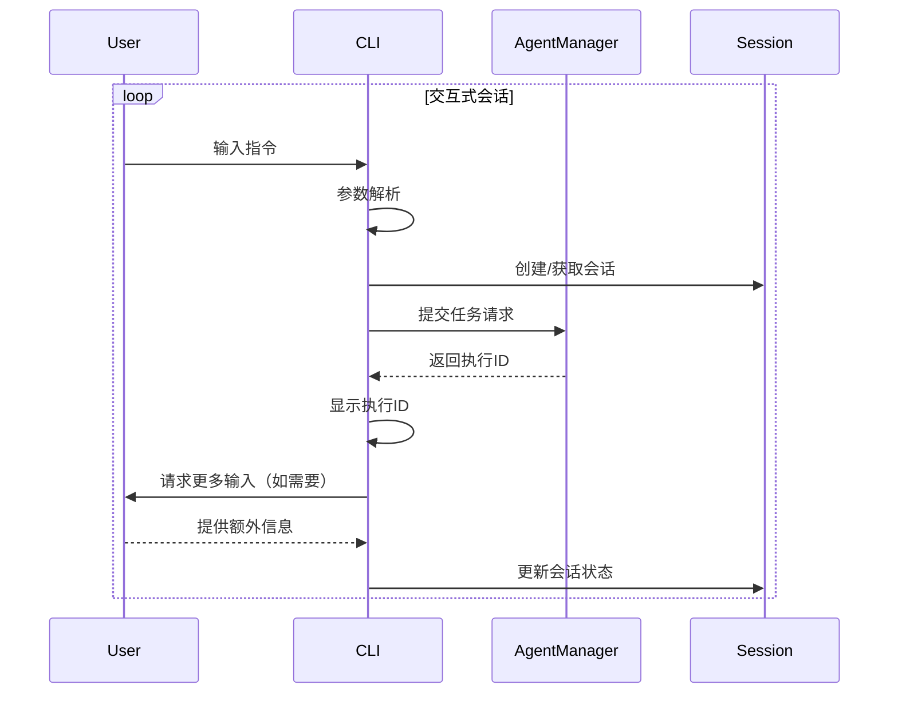
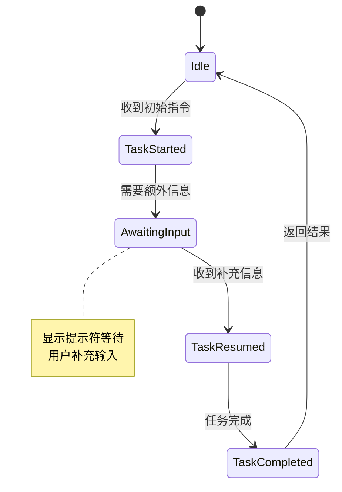

# 命令行交互模块详细设计文档

## 1. 模块职责
- 提供用户命令行输入接口
- 解析用户指令并转换为内部消息格式
- 管理交互式会话状态
- 实现多轮对话处理能力
- 展示结构化执行结果

## 2. 核心组件设计

### 2.1 CLIInterface


### 2.2 SessionManager


## 3. 交互流程设计


## 4. 命令行实现
```python
# cli/interface.py
import argparse
from typing import Dict, Any

class CLIInterface:
    def __init__(self, agent_manager):
        self.agent_manager = agent_manager
        self.session_id = None

    def start_interactive(self):
        """启动交互式会话"""
        print("AI Agent CLI 已启动 (输入 'exit' 退出)")
        while True:
            try:
                user_input = input(">>> ")
                if user_input.lower() in ['exit', 'quit']:
                    break
                self._process_input(user_input)
            except KeyboardInterrupt:
                print("\n正在退出...")
                break

    def _process_input(self, input_text: str):
        """处理用户输入"""
        # 解析指令
        args = self._parse_input(input_text)
        
        # 创建会话（如需要）
        if not self.session_id:
            self.session_id = self._create_session()
            
        # 执行任务
        result = self.agent_manager.execute_task(self.session_id, args)
        
        # 展示结果
        self._display_result(result)

    def _parse_input(self, input_text: str) -> Dict[str, Any]:
        """解析用户输入"""
        # 实现自然语言解析逻辑
        return {
            "command": "execute",
            "parameters": {"query": input_text}
        }
```

## 5. 交互式特性


## 6. 安全与可靠性
- 输入验证：使用argparse进行参数校验
- 异常处理：捕获并格式化显示所有异常
- 会话超时：空闲超过10分钟自动结束
- 历史记录：保存最近50条指令记录
- 安全退出：优雅处理Ctrl+C和进程终止

## 7. 扩展性设计
- 插件系统：支持通过entry_points扩展命令
- 主题支持：可配置的输出格式和颜色方案
- 日志记录：详细记录所有交互过程
- API代理：支持通过CLI调用内部API
- 多路复用：支持同时管理多个会话