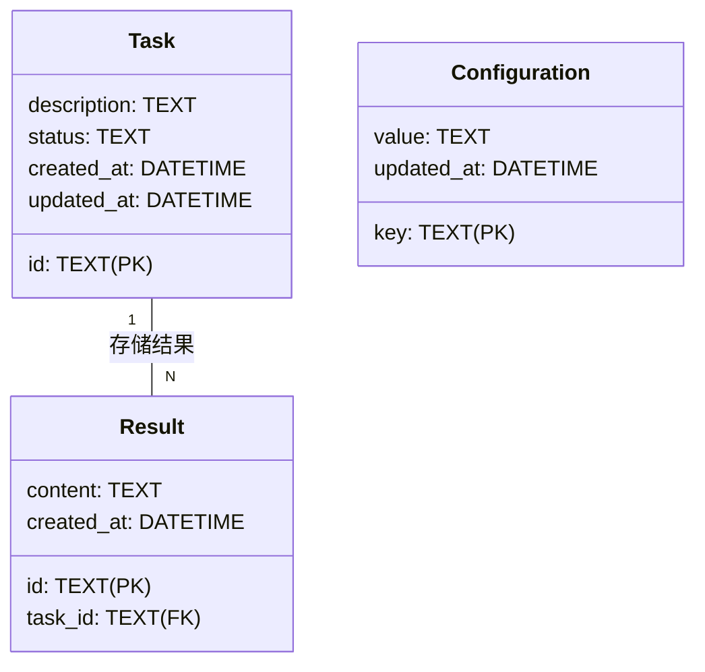
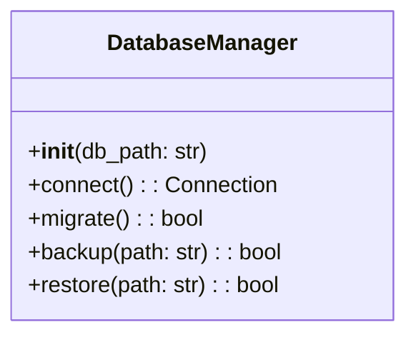
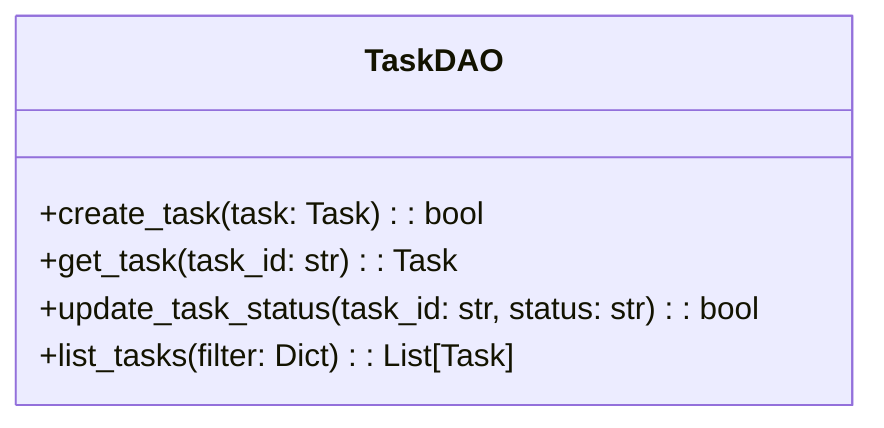
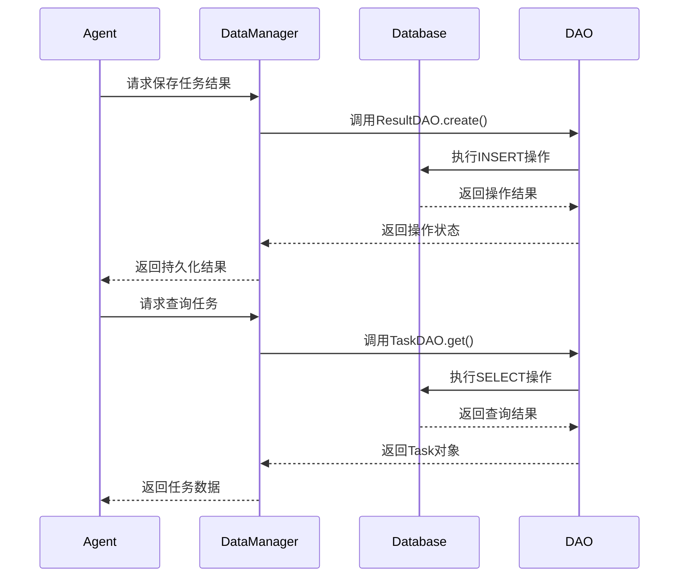

# 数据管理模块详细设计文档

## 1. 模块职责
- 提供SQLite3数据库的连接与管理
- 实现任务数据的持久化存储
- 管理执行结果的持久化与查询
- 维护系统配置的持久化管理
- 提供数据迁移与版本控制功能

## 2. 数据库设计

### 2.1 数据表结构


## 3. 核心组件设计

### 3.1 DatabaseManager


### 3.2 TaskDAO


## 4. 数据访问流程


## 5. 数据库实现
```python
# data/database.py
import sqlite3
from typing import Optional, Dict, Any

class DatabaseManager:
    def __init__(self, db_path: str):
        self.db_path = db_path
        self.connection = None

    def connect(self):
        """建立数据库连接"""
        self.connection = sqlite3.connect(self.db_path)
        self._initialize_tables()
        return self.connection

    def _initialize_tables(self):
        """初始化数据表结构"""
        with self.connection:
            self.connection.execute('''
                CREATE TABLE IF NOT EXISTS tasks (
                    id TEXT PRIMARY KEY,
                    description TEXT,
                    status TEXT,
                    created_at DATETIME,
                    updated_at DATETIME
                )
            ''')
            # 其他表结构创建语句...
```

## 6. 安全与可靠性
- 数据库连接池：使用连接池管理数据库连接，避免频繁创建和销毁连接
- 事务管理：对涉及多个表的操作使用事务保证数据一致性
- SQL注入防护：所有查询使用参数化语句
- 数据验证：在数据写入前进行类型和格式验证
- 备份恢复：实现自动备份和手动恢复功能

## 7. 性能优化
- 索引优化：在频繁查询字段（如task_id, status）上创建索引
- 查询优化：使用批量操作减少数据库交互次数
- 缓存机制：对频繁访问的配置数据实现内存缓存
- 连接复用：实现连接复用减少建立连接的开销
- 异步操作：对非实时性要求不高的操作使用异步写入