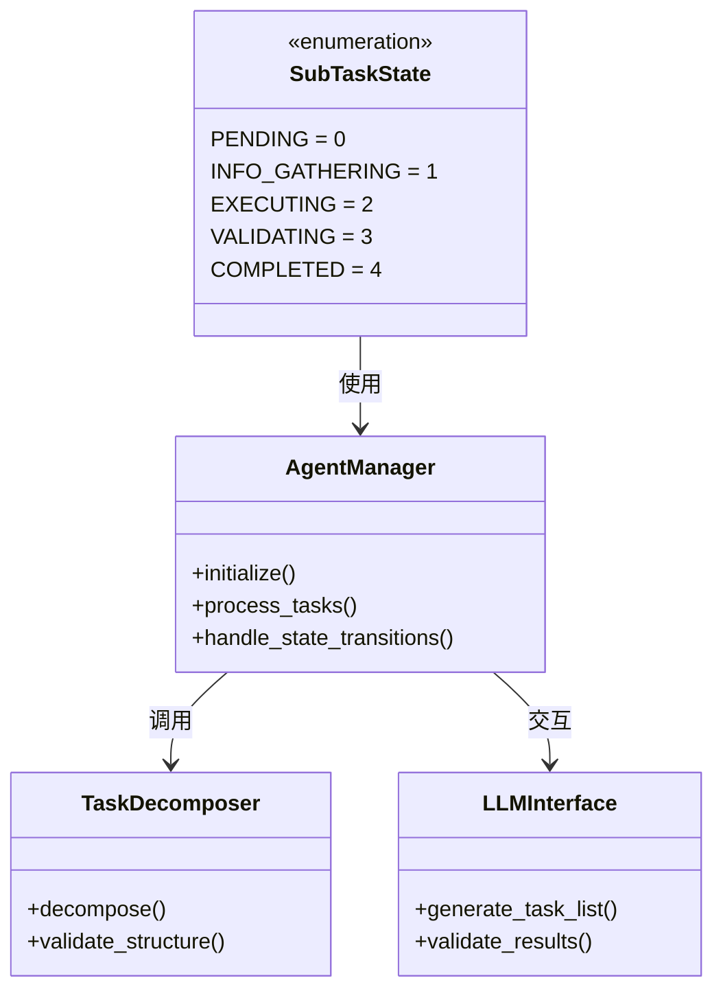
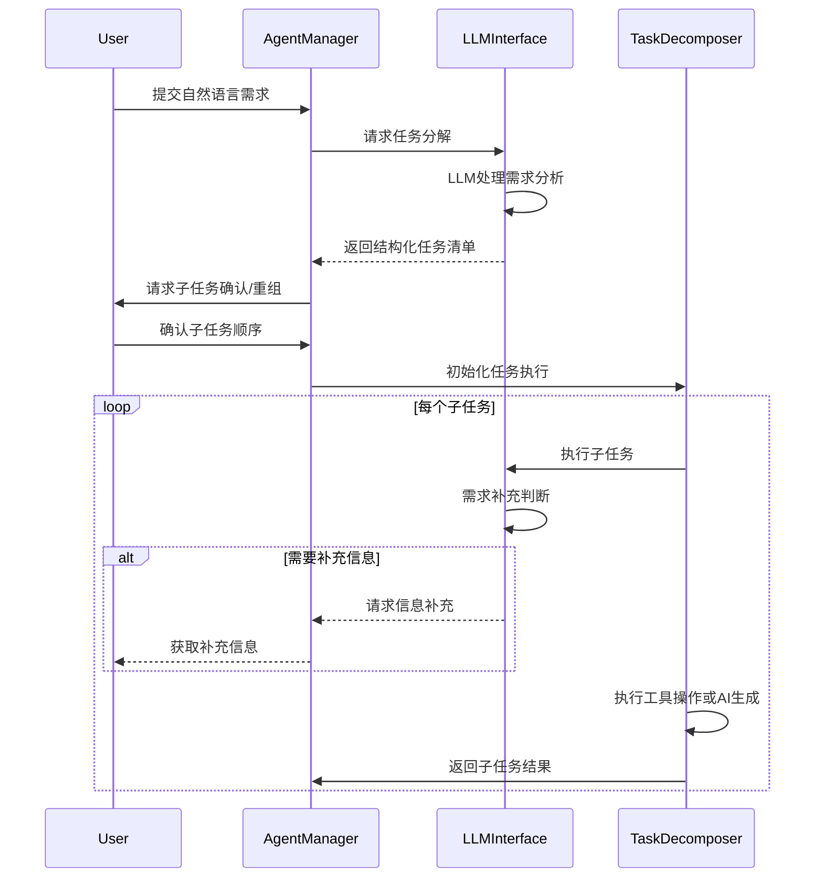

# Agent流程管理模块设计文档

## 1. 模块概述
本模块实现基于CrewAI框架的Agent流程引擎，负责任务分解、状态管理和执行调度。核心功能包括自然语言需求解析、线性任务执行和子任务状态机管理。

## 2. 模块职责
- 接收自然语言需求并转换为结构化任务清单
- 管理任务分解与重组（支持用户手动调整）
- 维护子任务状态机（PENDING/INFO_GATHERING/EXECUTING/VALIDATING/COMPLETED）
- 协调LLM交互与工具调用
- 处理多阶段结果验证流程


## 3. 类图


## 4. 序列图


## 5. 接口定义
```python
class SubTaskState(Enum):
    """子任务状态枚举"""
    PENDING = 0
    INFO_GATHERING = 1
    EXECUTING = 2
    VALIDATING = 3
    COMPLETED = 4

from crewai import Task
class ITaskProcessor:
    def decompose(self, user_input: str) -> List[Task]:
        """将自然语言需求分解为结构化任务清单"""
    
    def execute(self, task: Task) -> Any:
        """执行单个子任务并返回结果"""
    
    def validate(self, result: Any) -> bool:
        """验证子任务执行结果"""
```

## 6. 数据结构
### Task格式
```json
{
  "task": {
    "id": "UUID",
    "description": "任务描述",
    "status": "SubTaskState",
    "context": "Array<any>",
    "dependencies": "Array<string>",
    "execution_plan": {
      "tool": "string",
      "parameters": "Object"
    }
  },
  "task_history": [
    {
      "timestamp": "ISO8601",
      "user_input": "string",
      "subtasks": "Array<task>",
      "results": "BLOB"
    }
  ]
}
```

### LLM交互的Task格式
根据这个要求生成解析函数

    ```xml
    <update_todo_list>
        <todos>
        [x] 已完成
        [-] 进行中
        [ ] 未开始
        </todos>
    </update_todo_list>
    ```

## 7. 依赖关系
- 依赖LLM接口模块进行任务分解和结果验证
- 依赖MCP工具管理模块执行具体操作
- 依赖本地数据管理模块进行任务持久化
- 与命令行交互模块进行用户输入输出交互