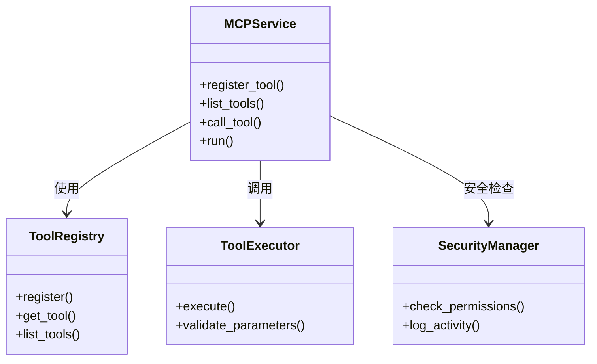
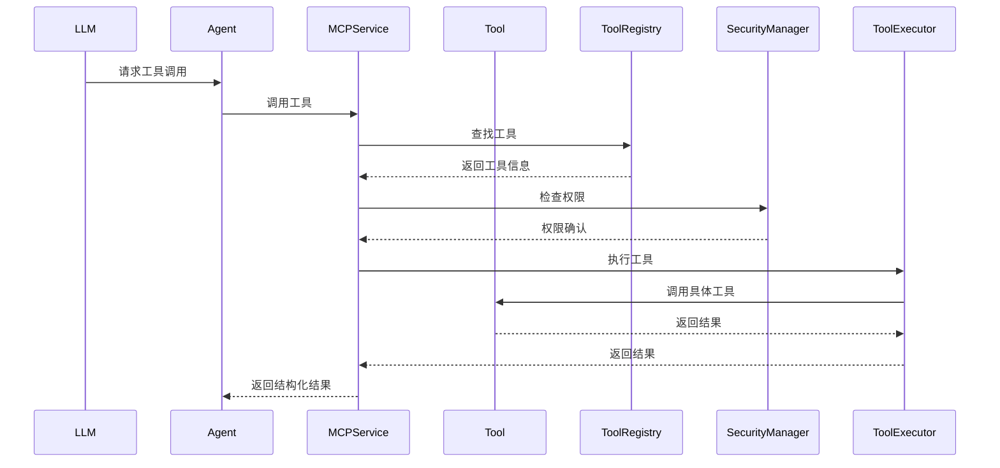

# MCP工具管理模块设计文档

## 1. 模块概述
本模块实现基于FastMCP的工具管理框架，负责MCP协议工具的注册、发现和调用。核心功能包括工具注册、协议解析、远程调用和结果返回。

## 2. 模块职责
- 实现MCP协议服务端，支持工具注册和发现
- 处理LLM生成的工具调用指令
- 执行本地工具操作（文件操作、代码执行等）
- 结构化返回工具执行结果
- 管理工具调用的安全性和权限控制

## 3. 类图


## 4. 序列图


## 5. 接口定义
```python
class IMCPTool:
    def name(self) -> str:
        """获取工具名称"""
    
    def description(self) -> str:
        """获取工具描述"""
    
    def input_schema(self) -> Dict:
        """获取输入参数schema"""
    
    def execute(self, params: Dict) -> Any:
        """执行工具操作"""

class MCPService:
    def register_tool(self, tool: IMCPTool):
        """注册新工具"""
    
    def call_tool(self, tool_name: str, params: Dict) -> Dict:
        """调用已注册工具"""
    
    def list_tools(self) -> List[Dict]:
        """列出所有可用工具"""

class ToolResult:
    def __init__(self, success: bool, content: Any, error: str = None):
        self.success = success
        self.content = content
        self.error = error
```

## 6. 数据结构
```json
{
  "tool_definition": {
    "name": "string",
    "description": "string",
    "inputSchema": {
      "type": "object",
      "properties": {},
      "required": []
    }
  },
  "tool_call": {
    "tool_name": "string",
    "parameters": "object"
  },
  "tool_result": {
    "success": "boolean",
    "content": "any",
    "error": "string"
  }
}
```

## 7. 依赖关系
- 依赖LLM接口模块进行工具选择和参数生成
- 依赖本地数据管理模块进行工具调用日志记录
- 与Agent流程管理模块进行任务状态同步
- 使用标准库执行文件系统操作和代码执行