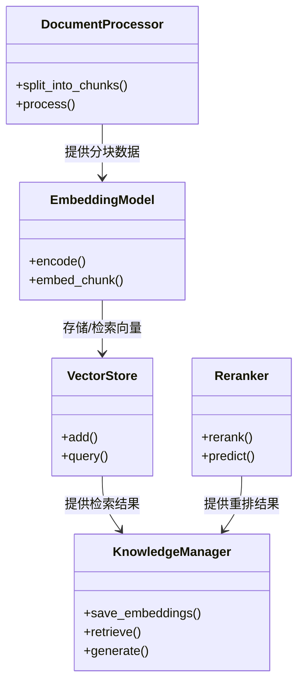
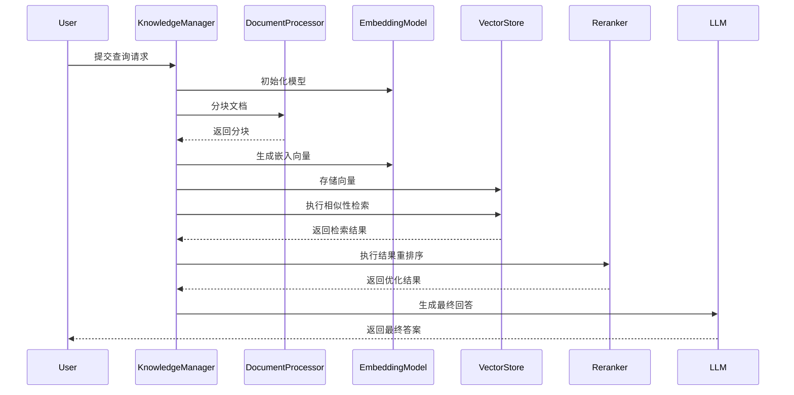

# RAG知识管理模块设计文档

## 1. 模块概述
本模块实现基于RAG（Retrieval-Augmented Generation）的知识增强系统，负责知识库的构建、检索和重排序。核心功能包括文档分块、向量化存储、相似性检索和结果重排序。
这个模块暂时不整合到系统中, 实现一个可独立运行的模块即可

## 2. 模块职责
- 文档预处理与分块
- 文本向量化与嵌入存储
- 相似性检索与结果返回
- 检索结果重排序与优化
- 知识库管理与更新

## 3. 类图


## 4. 序列图


## 5. 接口定义
```python
class IDocumentProcessor:
    def split_into_chunks(self, doc_file: str) -> List[str]:
        """将文档文件分割为内容块"""
    
    def process(self, content: str) -> List[str]:
        """处理原始内容并分割为块"""

class IEmbeddingModel:
    def encode(self, text: str, normalize: bool = False) -> List[float]:
        """将文本编码为向量表示"""
    
    def embed_chunk(self, chunk: str) -> List[float]:
        """将内容块转换为嵌入向量"""

class IVectorStore:
    def add(self, documents: List[str], embeddings: List[List[float]], ids: List[str]):
        """添加文档及其向量表示到存储"""
    
    def query(self, query_embedding: List[float], n_results: int) -> Dict:
        """根据查询向量检索最相似的文档"""

class IReranker:
    def rerank(self, query: str, retrieved_chunks: List[str], top_k: int) -> List[str]:
        """对检索结果进行重排序优化"""
```

## 6. 数据结构
```json
{
  "document_chunk": {
    "id": "string",
    "content": "string",
    "metadata": {
      "source": "string",
      "position": "integer"
    }
  },
  "embedding": {
    "dimension": "integer",
    "values": "number[]"
  },
  "retrieval_result": {
    "documents": "string[]",
    "distances": "number[]",
    "metadatas": "object[]"
  },
  "reranked_result": {
    "chunks": "string[]",
    "scores": "number[]"
  }
}
```

## 7. 依赖关系
- 依赖LLM接口模块进行最终答案生成
- 依赖本地数据管理模块进行持久化存储
- 与命令行交互模块进行用户输入输出交互
- 使用第三方库（Sentence Transformers, ChromaDB）实现核心功能