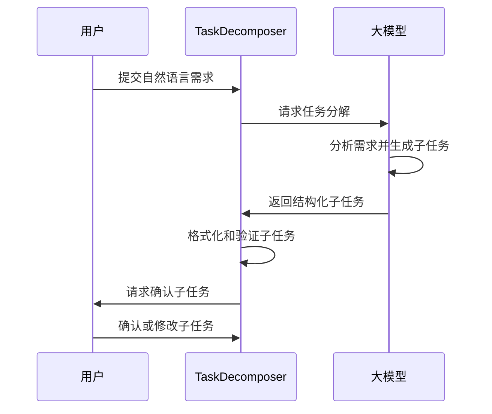
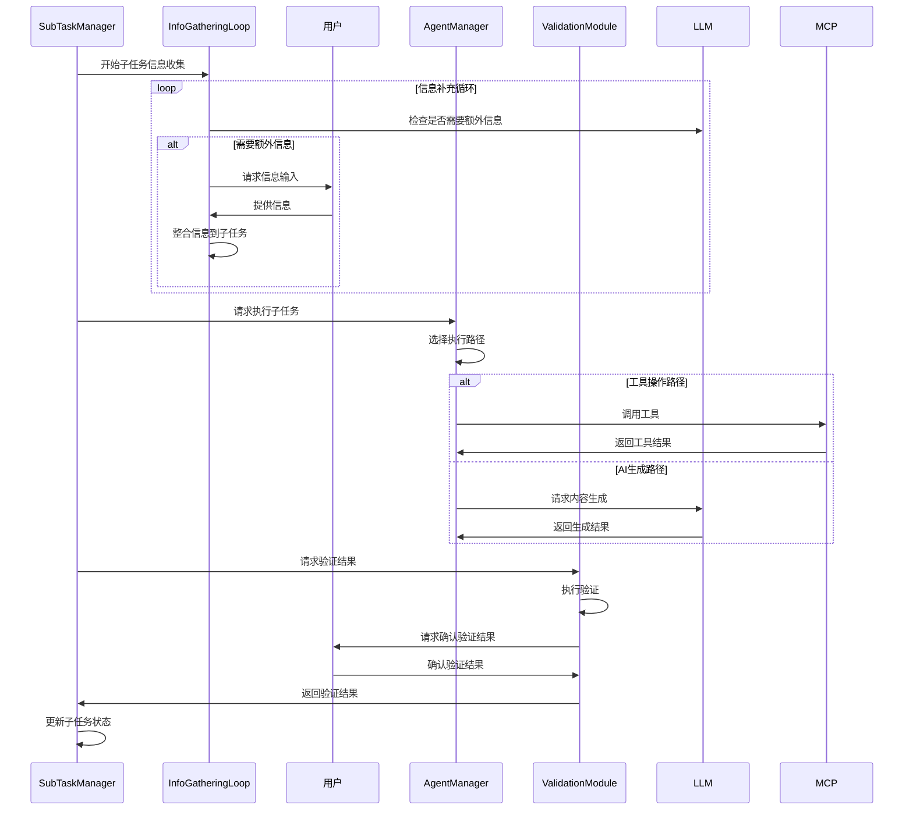

# Agent流程管理模块设计文档

## 模块概述

Agent流程管理模块是AI Agent Flow系统的核心组件，负责管理多智能体协作、任务分解、子任务执行和结果验证的全流程。该模块基于CrewAI框架实现，提供灵活的任务流水线管理能力。

## 模块职责

1. **任务分解**：将用户自然语言需求分解为结构化子任务
2. **Agent管理**：创建和管理多个专业领域的智能体
3. **任务调度**：协调智能体按顺序执行任务
4. **状态管理**：跟踪子任务执行状态和上下文信息
5. **结果验证**：对子任务执行结果进行验证和反馈

## 核心组件

### 1. Agent管理器 (AgentManager)

```python
class AgentManager:
    """智能体管理器，负责创建和管理多个专业领域的智能体"""
    
    def __init__(self, llm_config):
        self.llm = LLM(llm_config)
        self.agents = {}
        self.tasks = {}
        self.crew = None
    
    def create_agent(self, agent_id, role, goal, backstory, tools=None):
        """创建新的智能体"""
        pass
    
    def create_task(self, task_id, description, expected_output, agent_id):
        """创建新任务"""
        pass
    
    def create_crew(self, process_type=Process.sequential):
        """创建CrewAI实例"""
        pass
    
    def execute_crew(self, inputs):
        """执行CrewAI任务流水线"""
        pass
```

### 2. 任务分解模块 (TaskDecomposer)

```python
class TaskDecomposer:
    """任务分解模块，负责将用户需求分解为结构化子任务"""
    
    def __init__(self, llm):
        self.llm = llm
    
    def decompose_requirement(self, user_requirement):
        """将用户需求分解为结构化子任务"""
        pass
    
    def format_subtasks(self, subtasks):
        """格式化子任务为XML或Markdown格式"""
        pass
    
    def validate_subtasks(self, subtasks):
        """验证子任务的完整性和合理性"""
        pass
```

### 3. 子任务管理器 (SubTaskManager)

```python
class SubTaskManager:
    """子任务管理器，负责子任务的状态管理和执行流程"""
    
    def __init__(self):
        self.subtasks = []
        self.current_index = 0
        self.context = {}
    
    def add_subtask(self, subtask):
        """添加子任务"""
        pass
    
    def get_current_subtask(self):
        """获取当前执行的子任务"""
        pass
    
    def update_subtask_status(self, subtask_id, status):
        """更新子任务状态"""
        pass
    
    def execute_subtask(self, subtask):
        """执行单个子任务"""
        pass
    
    def execute_all_subtasks(self):
        """执行所有子任务"""
        pass
```

### 4. 信息补充循环 (InfoGatheringLoop)

```python
class InfoGatheringLoop:
    """信息补充循环，负责在子任务执行前收集必要信息"""
    
    def __init__(self, llm, max_rounds=5):
        self.llm = llm
        self.max_rounds = max_rounds
    
    async def gather_info(self, subtask):
        """为子任务收集必要信息"""
        pass
    
    async def check_info_need(self, subtask):
        """检查子任务是否需要额外信息"""
        pass
    
    async def request_user_input(self, request):
        """向用户请求信息输入"""
        pass
    
    def integrate_info(self, subtask, user_input):
        """将用户输入整合到子任务中"""
        pass
```

### 5. 验证模块 (ValidationModule)

```python
class ValidationModule:
    """验证模块，负责对子任务执行结果进行验证"""
    
    def __init__(self, llm):
        self.llm = llm
    
    def validate_result(self, subtask, result):
        """验证子任务执行结果"""
        pass
    
    def generate_validation_report(self, validation_result):
        """生成验证报告"""
        pass
    
    def request_user_validation(self, validation_report):
        """请求用户确认验证结果"""
        pass
```

## 子任务状态机

```python
class SubTaskState(Enum):
    """子任务状态枚举"""
    PENDING = 0          # 待执行
    INFO_GATHERING = 1   # 信息收集中
    EXECUTING = 2        # 执行中
    VALIDATING = 3       # 验证中
    COMPLETED = 4        # 已完成
    FAILED = 5           # 失败
```

## 数据结构

### 1. 子任务结构

```python
class SubTask:
    """子任务数据结构"""
    
    def __init__(self, task_id, description, expected_output):
        self.task_id = task_id
        self.description = description
        self.expected_output = expected_output
        self.status = SubTaskState.PENDING
        self.context = []          # 上下文信息
        self.result = None         # 执行结果
        self.validation_report = None  # 验证报告
        self.info_requests = []    # 信息请求历史
        self.execution_path = None  # 执行路径（工具操作/AI生成）
```

### 2. Agent配置

```python
class AgentConfig:
    """智能体配置"""
    
    def __init__(self, role, goal, backstory, tools=None, 
                 allow_delegation=False, allow_code_execution=False):
        self.role = role
        self.goal = goal
        self.backstory = backstory
        self.tools = tools or []
        self.allow_delegation = allow_delegation
        self.allow_code_execution = allow_code_execution
```

## 工作流程

### 1. 任务分解流程



### 2. 子任务执行流程



## 关键算法

### 1. 任务分解算法

```python
def decompose_requirement(self, user_requirement):
    """
    任务分解算法
    1. 分析用户需求的复杂度和类型
    2. 根据需求类型选择分解策略
    3. 生成结构化子任务列表
    4. 验证子任务的完整性和依赖关系
    """
    prompt = f"""
    请将以下用户需求分解为结构化子任务：
    
    用户需求：{user_requirement}
    
    请按照以下格式输出：
    <update_todo_list>
        <todos>
        [ ] 子任务1描述
        [ ] 子任务2描述
        [ ] 子任务3描述
        </todos>
    </update_todo_list>
    """
    
    response = self.llm.generate(prompt)
    return self.parse_subtasks(response)
```

### 2. 信息补充循环算法

```python
async def gather_info(self, subtask):
    """
    信息补充循环算法
    1. 检查子任务是否需要额外信息
    2. 如果需要，向用户请求信息
    3. 整合用户输入到子任务上下文
    4. 重复直到满足条件或达到最大循环次数
    """
    round_count = 0
    while round_count < self.max_rounds:
        need_more, request = await self.check_info_need(subtask)
        if not need_more:
            break
            
        user_input = await self.request_user_input(request)
        self.integrate_info(subtask, user_input)
        round_count += 1
    
    return subtask
```

## 配置参数

### 1. Agent管理器配置

```python
AGENT_MANAGER_CONFIG = {
    "llm": {
        "model": "openai/gpt-4o",
        "temperature": 0.7,
        "max_tokens": 4000
    },
    "default_process": "sequential",
    "max_agents": 10,
    "max_tasks": 50
}
```

### 2. 任务分解配置

```python
TASK_DECOMPOSER_CONFIG = {
    "max_subtasks": 20,
    "min_subtasks": 1,
    "enable_user_confirmation": True,
    "output_format": "xml"  # xml or markdown
}
```

### 3. 信息补充配置

```python
INFO_GATHERING_CONFIG = {
    "max_rounds": 5,
    "timeout_seconds": 300,
    "allowed_info_types": [
        "natural_language",
        "file_upload",
        "file_list",
        "file_content"
    ]
}
```

## 错误处理

### 1. 任务分解错误

```python
class TaskDecompositionError(Exception):
    """任务分解错误"""
    pass

class InvalidSubtaskError(Exception):
    """无效子任务错误"""
    pass
```

### 2. 子任务执行错误

```python
class SubTaskExecutionError(Exception):
    """子任务执行错误"""
    pass

class InfoGatheringTimeoutError(Exception):
    """信息收集超时错误"""
    pass
```

### 3. 验证错误

```python
class ValidationError(Exception):
    """验证错误"""
    pass

class UserRejectionError(Exception):
    """用户拒绝错误"""
    pass
```

## 性能优化

### 1. 智能体复用

- 复用相同角色的智能体实例
- 缓存智能体的配置和状态
- 实现智能体的懒加载

### 2. 任务并行化

- 支持独立子任务的并行执行
- 实现任务依赖关系管理
- 优化任务调度算法

### 3. 上下文管理

- 实现上下文信息的增量更新
- 优化上下文传递机制
- 减少重复的上下文处理

## 测试策略

### 1. 单元测试

- 测试各个组件的核心功能
- 验证状态转换的正确性
- 测试错误处理机制

### 2. 集成测试

- 测试组件间的交互
- 验证完整的任务执行流程
- 测试信息补充循环

### 3. 系统测试

- 测试端到端的用户需求处理
- 验证系统的稳定性和可靠性
- 测试性能和资源使用

## 扩展性考虑

### 1. 插件化架构

- 支持自定义智能体类型
- 允许扩展任务分解策略
- 支持自定义验证规则

### 2. 多语言支持

- 支持多种自然语言输入
- 实现多语言的任务分解
- 支持多语言的结果输出

### 3. 分布式执行

- 支持智能体的分布式部署
- 实现任务的分布式执行
- 支持分布式上下文管理
