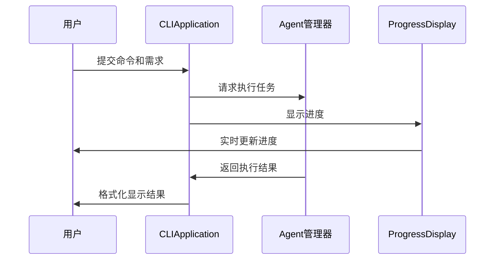
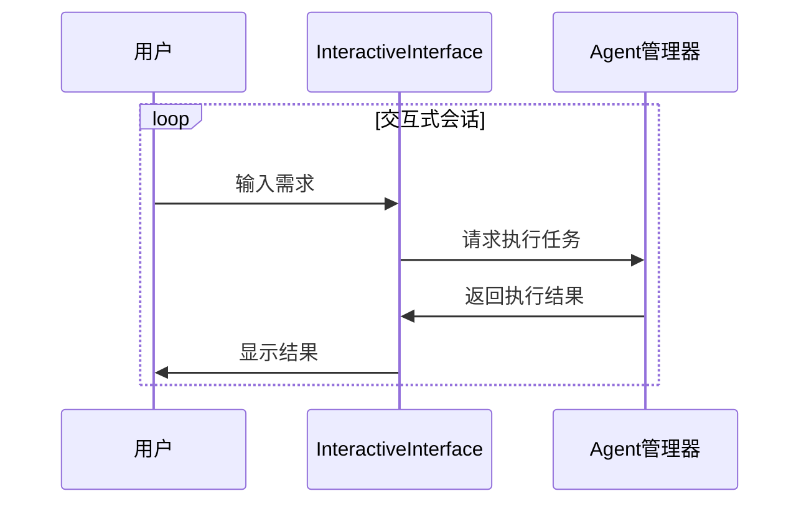

# 命令行交互模块设计文档

## 模块概述

命令行交互模块是AI Agent Flow系统的用户交互层，负责提供直观、友好的命令行界面。该模块基于Python argparse和rich库实现，支持多种交互模式、进度显示、结果格式化等功能，为用户提供流畅的系统使用体验。

## 模块职责

1. **命令解析**：解析用户输入的命令和参数
2. **交互模式**：提供多种交互模式（单次执行、交互式会话等）
3. **进度显示**：实时显示任务执行进度和状态
4. **结果展示**：格式化和展示任务执行结果
5. **用户引导**：提供命令帮助和使用提示
6. **错误处理**：处理和展示用户输入错误

## 核心组件

### 1. 命令行解析器 (CLIParser)

```python
import argparse
from typing import List, Dict, Optional

class CLIParser:
    """命令行解析器，负责解析用户输入的命令和参数"""
    
    def __init__(self):
        self.parser = self._create_parser()
        self.subparsers = self.parser.add_subparsers(dest='command', help='可用命令')
        self._register_commands()
    
    def _create_parser(self) -> argparse.ArgumentParser:
        """创建主解析器"""
        parser = argparse.ArgumentParser(
            prog='ai-agent-flow',
            description='AI Agent Flow - 基于多智能体协作的AI驱动工程实现闭环系统',
            formatter_class=argparse.RawDescriptionHelpFormatter,
            epilog='''
示例:
  %(prog)s "设计一个用户管理系统"
  %(prog)s --interactive
  %(prog)s config --set llm_model "openai/gpt-4o"
  %(prog)s history --list
            '''
        )
        
        # 全局选项
        parser.add_argument(
            '--version', 
            action='version', 
            version='%(prog)s 1.0.0'
        )
        
        parser.add_argument(
            '--verbose', '-v',
            action='store_true',
            help='显示详细输出'
        )
        
        parser.add_argument(
            '--config', '-c',
            type=str,
            default='config.json',
            help='配置文件路径'
        )
        
        return parser
    
    def _register_commands(self):
        """注册所有子命令"""
        self._register_run_command()
        self._register_interactive_command()
        self._register_config_command()
        self._register_history_command()
        self._register_knowledge_command()
        self._register_backup_command()
    
    def _register_run_command(self):
        """注册运行命令"""
        run_parser = self.subparsers.add_parser(
            'run',
            help='执行单个任务'
        )
        
        run_parser.add_argument(
            'requirement',
            type=str,
            help='用户需求描述'
        )
        
        run_parser.add_argument(
            '--session-id',
            type=str,
            help='会话ID'
        )
        
        run_parser.add_argument(
            '--output', '-o',
            type=str,
            help='输出文件路径'
        )
        
        run_parser.add_argument(
            '--format',
            choices=['json', 'markdown', 'text'],
            default='text',
            help='输出格式'
        )
    
    def _register_interactive_command(self):
        """注册交互式命令"""
        interactive_parser = self.subparsers.add_parser(
            'interactive',
            aliases=['i'],
            help='启动交互式会话'
        )
        
        interactive_parser.add_argument(
            '--session-id',
            type=str,
            help='会话ID'
        )
        
        interactive_parser.add_argument(
            '--history',
            type=int,
            default=10,
            help='显示的历史记录数量'
        )
    
    def _register_config_command(self):
        """注册配置命令"""
        config_parser = self.subparsers.add_parser(
            'config',
            help='管理系统配置'
        )
        
        config_subparsers = config_parser.add_subparsers(dest='config_action')
        
        # 设置配置
        set_parser = config_subparsers.add_parser('set', help='设置配置项')
        set_parser.add_argument('key', type=str, help='配置键')
        set_parser.add_argument('value', type=str, help='配置值')
        set_parser.add_argument('--description', type=str, help='配置描述')
        
        # 获取配置
        get_parser = config_subparsers.add_parser('get', help='获取配置项')
        get_parser.add_argument('key', type=str, help='配置键')
        
        # 列出所有配置
        list_parser = config_subparsers.add_parser('list', help='列出所有配置')
        
        # 删除配置
        delete_parser = config_subparsers.add_parser('delete', help='删除配置项')
        delete_parser.add_argument('key', type=str, help='配置键')
    
    def _register_history_command(self):
        """注册历史命令"""
        history_parser = self.subparsers.add_parser(
            'history',
            aliases=['h'],
            help='管理任务历史'
        )
        
        history_subparsers = history_parser.add_subparsers(dest='history_action')
        
        # 列出历史
        list_parser = history_subparsers.add_parser('list', help='列出任务历史')
        list_parser.add_argument('--limit', type=int, default=20, help='显示数量')
        list_parser.add_argument('--session-id', type=str, help='按会话ID过滤')
        list_parser.add_argument('--status', type=str, help='按状态过滤')
        
        # 显示详情
        show_parser = history_subparsers.add_parser('show', help='显示任务详情')
        show_parser.add_argument('task_id', type=int, help='任务ID')
        
        # 清除历史
        clear_parser = history_subparsers.add_parser('clear', help='清除任务历史')
        clear_parser.add_argument('--all', action='store_true', help='清除所有历史')
        clear_parser.add_argument('--session-id', type=str, help='清除指定会话的历史')
    
    def _register_knowledge_command(self):
        """注册知识管理命令"""
        knowledge_parser = self.subparsers.add_parser(
            'knowledge',
            aliases=['k'],
            help='管理知识库'
        )
        
        knowledge_subparsers = knowledge_parser.add_subparsers(dest='knowledge_action')
        
        # 添加知识源
        add_parser = knowledge_subparsers.add_parser('add', help='添加知识源')
        add_parser.add_argument('name', type=str, help='知识源名称')
        add_parser.add_argument('path', type=str, help='知识源路径')
        add_parser.add_argument('--type', type=str, default='document', help='知识源类型')
        
        # 列出知识源
        list_parser = knowledge_subparsers.add_parser('list', help='列出知识源')
        
        # 删除知识源
        delete_parser = knowledge_subparsers.add_parser('delete', help='删除知识源')
        delete_parser.add_argument('source_id', type=int, help='知识源ID')
        
        # 更新知识源
        update_parser = knowledge_subparsers.add_parser('update', help='更新知识源')
        update_parser.add_argument('source_id', type=int, help='知识源ID')
        update_parser.add_argument('--name', type=str, help='新名称')
        update_parser.add_argument('--path', type=str, help='新路径')
        update_parser.add_argument('--status', type=str, help='新状态')
    
    def _register_backup_command(self):
        """注册备份命令"""
        backup_parser = self.subparsers.add_parser(
            'backup',
            help='管理数据备份'
        )
        
        backup_subparsers = backup_parser.add_subparsers(dest='backup_action')
        
        # 创建备份
        create_parser = backup_subparsers.add_parser('create', help='创建备份')
        create_parser.add_argument('--name', type=str, help='备份名称')
        
        # 列出备份
        list_parser = backup_subparsers.add_parser('list', help='列出备份')
        
        # 恢复备份
        restore_parser = backup_subparsers.add_parser('restore', help='恢复备份')
        restore_parser.add_argument('backup_name', type=str, help='备份名称')
        
        # 删除备份
        delete_parser = backup_subparsers.add_parser('delete', help='删除备份')
        delete_parser.add_argument('backup_name', type=str, help='备份名称')
    
    def parse_args(self, args: Optional[List[str]] = None) -> argparse.Namespace:
        """解析命令行参数"""
        return self.parser.parse_args(args)
```

### 2. 交互式界面 (InteractiveInterface)

```python
import asyncio
from rich.console import Console
from rich.panel import Panel
from rich.text import Text
from rich.prompt import Prompt, Confirm
from rich.progress import Progress, SpinnerColumn, TextColumn
from rich.table import Table
from rich.live import Live
from typing import Dict, List, Optional

class InteractiveInterface:
    """交互式界面，提供交互式会话功能"""
    
    def __init__(self, console: Optional[Console] = None):
        self.console = console or Console()
        self.session_id = None
        self.history = []
        self.context = {}
    
    async def start_session(self, session_id: Optional[str] = None, history_count: int = 10):
        """启动交互式会话"""
        if not session_id:
            session_id = self._generate_session_id()
        
        self.session_id = session_id
        
        # 显示欢迎信息
        self._show_welcome()
        
        # 加载历史记录
        await self._load_history(history_count)
        
        # 主循环
        while True:
            try:
                # 获取用户输入
                user_input = await self._get_user_input()
                
                # 检查退出命令
                if user_input.lower() in ['exit', 'quit', 'q']:
                    if await self._confirm_exit():
                        break
                    else:
                        continue
                
                # 处理特殊命令
                if user_input.startswith('/'):
                    await self._handle_special_command(user_input[1:])
                    continue
                
                # 执行任务
                await self._execute_task(user_input)
                
            except KeyboardInterrupt:
                if await self._confirm_exit():
                    break
            except Exception as e:
                self.console.print(f"[red]错误: {str(e)}[/red]")
        
        # 显示告别信息
        self._show_goodbye()
    
    def _generate_session_id(self) -> str:
        """生成会话ID"""
        import uuid
        return str(uuid.uuid4())[:8]
    
    def _show_welcome(self):
        """显示欢迎信息"""
        welcome_text = Text()
        welcome_text.append("AI Agent Flow - 交互式会话\n\n", style="bold blue")
        welcome_text.append(f"会话ID: {self.session_id}\n", style="green")
        welcome_text.append("输入 'exit' 或按 Ctrl+C 退出\n", style="yellow")
        welcome_text.append("输入 '/help' 查看帮助信息", style="yellow")
        
        self.console.print(Panel(welcome_text, title="欢迎", border_style="blue"))
    
    def _show_goodbye(self):
        """显示告别信息"""
        self.console.print(Panel("感谢使用 AI Agent Flow!", title="再见", border_style="blue"))
    
    async def _get_user_input(self) -> str:
        """获取用户输入"""
        return await Prompt.ask("请输入您的需求")
    
    async def _confirm_exit(self) -> bool:
        """确认退出"""
        return await Confirm.ask("确定要退出吗?")
    
    async def _load_history(self, count: int):
        """加载历史记录"""
        # 这里应该从数据库加载历史记录
        # 简化实现，使用空列表
        self.history = []
    
    async def _handle_special_command(self, command: str):
        """处理特殊命令"""
        if command == "help":
            self._show_help()
        elif command == "history":
            self._show_session_history()
        elif command == "clear":
            self.console.clear()
        elif command == "context":
            self._show_context()
        else:
            self.console.print(f"[red]未知命令: /{command}[/red]")
    
    def _show_help(self):
        """显示帮助信息"""
        help_table = Table(title="可用命令")
        help_table.add_column("命令", style="cyan")
        help_table.add_column("描述", style="white")
        
        commands = [
            ("/help", "显示帮助信息"),
            ("/history", "显示会话历史"),
            ("/clear", "清空屏幕"),
            ("/context", "显示当前上下文"),
            ("/exit", "退出会话")
        ]
        
        for cmd, desc in commands:
            help_table.add_row(cmd, desc)
        
        self.console.print(help_table)
    
    def _show_session_history(self):
        """显示会话历史"""
        if not self.history:
            self.console.print("[yellow]暂无历史记录[/yellow]")
            return
        
        history_table = Table(title="会话历史")
        history_table.add_column("序号", style="cyan")
        history_table.add_column("用户输入", style="white")
        
        for i, item in enumerate(self.history[-10:], 1):  # 显示最近10条
            history_table.add_row(str(i), item['user_input'][:50] + "..." if len(item['user_input']) > 50 else item['user_input'])
        
        self.console.print(history_table)
    
    def _show_context(self):
        """显示当前上下文"""
        if not self.context:
            self.console.print("[yellow]当前上下文为空[/yellow]")
            return
        
        context_panel = Panel(
            str(self.context),
            title="当前上下文",
            border_style="green"
        )
        self.console.print(context_panel)
    
    async def _execute_task(self, user_input: str):
        """执行任务"""
        # 显示进度
        with Progress(
            SpinnerColumn(),
            TextColumn("[progress.description]{task.description}"),
            console=self.console
        ) as progress:
            task = progress.add_task("正在处理您的需求...", total=None)
            
            try:
                # 这里应该调用Agent管理器执行任务
                # 简化实现，模拟任务执行
                await asyncio.sleep(1)
                
                # 更新进度
                progress.update(task, description="任务执行完成")
                
                # 添加到历史记录
                self.history.append({
                    'user_input': user_input,
                    'timestamp': asyncio.get_event_loop().time()
                })
                
                # 显示结果
                self._show_task_result(user_input)
                
            except Exception as e:
                progress.update(task, description=f"执行失败: {str(e)}")
                self.console.print(f"[red]任务执行失败: {str(e)}[/red]")
    
    def _show_task_result(self, user_input: str):
        """显示任务结果"""
        result_panel = Panel(
            f"任务: {user_input}\n\n结果: 任务已成功执行",
            title="任务结果",
            border_style="green"
        )
        self.console.print(result_panel)
```

### 3. 进度显示器 (ProgressDisplay)

```python
from rich.progress import Progress, SpinnerColumn, TextColumn, BarColumn, TimeRemainingColumn
from rich.live import Live
from typing import Dict, Any, Optional

class ProgressDisplay:
    """进度显示器，负责显示任务执行进度"""
    
    def __init__(self, console: Optional[Console] = None):
        self.console = console or Console()
        self.progress = Progress(
            SpinnerColumn(),
            TextColumn("[progress.description]{task.description}"),
            BarColumn(),
            TextColumn("[progress.percentage]{task.percentage:>3.0f}%"),
            TimeRemainingColumn(),
            console=self.console
        )
        self.tasks = {}
    
    def __enter__(self):
        """进入上下文管理器"""
        self.live = Live(self.progress, console=self.console, refresh_per_second=10)
        self.live.start()
        return self
    
    def __exit__(self, exc_type, exc_val, exc_tb):
        """退出上下文管理器"""
        self.live.stop()
    
    def add_task(self, task_id: str, description: str, total: Optional[int] = None) -> str:
        """添加进度任务"""
        task_id = self.progress.add_task(description, total=total)
        self.tasks[task_id] = task_id
        return task_id
    
    def update_task(self, task_id: str, **kwargs):
        """更新进度任务"""
        if task_id in self.tasks:
            self.progress.update(self.tasks[task_id], **kwargs)
    
    def complete_task(self, task_id: str):
        """完成进度任务"""
        if task_id in self.tasks:
            self.progress.update(self.tasks[task_id], completed=self.progress.tasks[self.tasks[task_id]].total)
    
    def show_spinner(self, description: str):
        """显示旋转加载器"""
        with self.progress:
            task_id = self.progress.add_task(description, total=None)
            return task_id
    
    def show_progress(self, description: str, current: int, total: int):
        """显示进度条"""
        with self.progress:
            task_id = self.progress.add_task(description, total=total)
            self.progress.update(task_id, completed=current)
            return task_id
```

### 4. 结果格式化器 (ResultFormatter)

```python
from rich.table import Table
from rich.panel import Panel
from rich.text import Text
from rich.syntax import Syntax
from rich.json import JSON
from typing import Dict, Any, List, Union
import json

class ResultFormatter:
    """结果格式化器，负责格式化和展示任务执行结果"""
    
    def __init__(self, console: Optional[Console] = None):
        self.console = console or Console()
    
    def format_result(self, result: Dict[str, Any], format_type: str = "text") -> str:
        """格式化结果"""
        if format_type == "json":
            return self._format_json(result)
        elif format_type == "markdown":
            return self._format_markdown(result)
        elif format_type == "table":
            return self._format_table(result)
        else:
            return self._format_text(result)
    
    def _format_json(self, result: Dict[str, Any]) -> str:
        """格式化为JSON"""
        return json.dumps(result, indent=2, ensure_ascii=False)
    
    def _format_markdown(self, result: Dict[str, Any]) -> str:
        """格式化为Markdown"""
        markdown_lines = ["# 任务结果\n"]
        
        for key, value in result.items():
            markdown_lines.append(f"## {key}\n")
            
            if isinstance(value, dict):
                markdown_lines.append("```json\n")
                markdown_lines.append(json.dumps(value, indent=2, ensure_ascii=False))
                markdown_lines.append("\n```\n")
            elif isinstance(value, list):
                for item in value:
                    markdown_lines.append(f"- {item}\n")
            else:
                markdown_lines.append(f"{value}\n")
        
        return "\n".join(markdown_lines)
    
    def _format_table(self, result: Dict[str, Any]) -> str:
        """格式化为表格"""
        table = Table(title="任务结果")
        table.add_column("属性", style="cyan")
        table.add_column("值", style="white")
        
        for key, value in result.items():
            if isinstance(value, (dict, list)):
                table.add_row(key, json.dumps(value, ensure_ascii=False))
            else:
                table.add_row(key, str(value))
        
        return str(table)
    
    def _format_text(self, result: Dict[str, Any]) -> str:
        """格式化为文本"""
        text_lines = ["任务结果:\n"]
        
        for key, value in result.items():
            text_lines.append(f"{key}: ")
            
            if isinstance(value, dict):
                text_lines.append(json.dumps(value, indent=2, ensure_ascii=False))
            elif isinstance(value, list):
                text_lines.append("\n".join(f"  - {item}" for item in value))
            else:
                text_lines.append(str(value))
            
            text_lines.append("\n")
        
        return "\n".join(text_lines)
    
    def display_result(self, result: Dict[str, Any], format_type: str = "text"):
        """显示结果"""
        if format_type == "json":
            self._display_json(result)
        elif format_type == "markdown":
            self._display_markdown(result)
        elif format_type == "table":
            self._display_table(result)
        else:
            self._display_text(result)
    
    def _display_json(self, result: Dict[str, Any]):
        """显示JSON格式结果"""
        json_str = json.dumps(result, indent=2, ensure_ascii=False)
        syntax = Syntax(json_str, "json", theme="monokai", line_numbers=True)
        self.console.print(Panel(syntax, title="任务结果 (JSON)", border_style="green"))
    
    def _display_markdown(self, result: Dict[str, Any]):
        """显示Markdown格式结果"""
        markdown_content = self._format_markdown(result)
        self.console.print(Panel(markdown_content, title="任务结果 (Markdown)", border_style="green"))
    
    def _display_table(self, result: Dict[str, Any]):
        """显示表格格式结果"""
        table = Table(title="任务结果")
        table.add_column("属性", style="cyan")
        table.add_column("值", style="white")
        
        for key, value in result.items():
            if isinstance(value, (dict, list)):
                table.add_row(key, json.dumps(value, ensure_ascii=False))
            else:
                table.add_row(key, str(value))
        
        self.console.print(table)
    
    def _display_text(self, result: Dict[str, Any]):
        """显示文本格式结果"""
        text_content = self._format_text(result)
        self.console.print(Panel(text_content, title="任务结果", border_style="green"))
    
    def display_code(self, code: str, language: str = "python"):
        """显示代码"""
        syntax = Syntax(code, language, theme="monokai", line_numbers=True)
        self.console.print(Panel(syntax, title=f"代码 ({language})", border_style="blue"))
    
    def display_error(self, error: str):
        """显示错误信息"""
        error_text = Text(error, style="red")
        self.console.print(Panel(error_text, title="错误", border_style="red"))
    
    def display_success(self, message: str):
        """显示成功信息"""
        success_text = Text(message, style="green")
        self.console.print(Panel(success_text, title="成功", border_style="green"))
    
    def display_warning(self, message: str):
        """显示警告信息"""
        warning_text = Text(message, style="yellow")
        self.console.print(Panel(warning_text, title="警告", border_style="yellow"))
```

### 5. 命令行应用 (CLIApplication)

```python
import asyncio
from typing import Optional

class CLIApplication:
    """命令行应用，负责协调整个命令行交互流程"""
    
    def __init__(self):
        self.parser = CLIParser()
        self.console = Console()
        self.formatter = ResultFormatter(self.console)
        self.interactive = InteractiveInterface(self.console)
    
    async def run(self, args: Optional[List[str]] = None):
        """运行命令行应用"""
        try:
            # 解析命令行参数
            parsed_args = self.parser.parse_args(args)
            
            # 根据命令类型执行相应操作
            if parsed_args.command == 'run':
                await self._handle_run_command(parsed_args)
            elif parsed_args.command in ['interactive', 'i']:
                await self._handle_interactive_command(parsed_args)
            elif parsed_args.command == 'config':
                await self._handle_config_command(parsed_args)
            elif parsed_args.command in ['history', 'h']:
                await self._handle_history_command(parsed_args)
            elif parsed_args.command in ['knowledge', 'k']:
                await self._handle_knowledge_command(parsed_args)
            elif parsed_args.command == 'backup':
                await self._handle_backup_command(parsed_args)
            else:
                self.parser.parser.print_help()
                
        except KeyboardInterrupt:
            self.console.print("\n[yellow]操作已取消[/yellow]")
        except Exception as e:
            self.formatter.display_error(f"应用运行错误: {str(e)}")
    
    async def _handle_run_command(self, args):
        """处理运行命令"""
        self.console.print(f"[blue]正在执行任务: {args.requirement}[/blue]")
        
        # 显示进度
        with ProgressDisplay(self.console) as progress:
            task_id = progress.show_spinner("正在处理您的需求...")
            
            try:
                # 这里应该调用Agent管理器执行任务
                # 简化实现，模拟任务执行
                await asyncio.sleep(2)
                
                # 更新进度
                progress.update_task(task_id, description="任务执行完成")
                
                # 模拟结果
                result = {
                    "task_id": "12345",
                    "status": "completed",
                    "message": "任务已成功执行",
                    "subtasks": [
                        {"id": 1, "description": "子任务1", "status": "completed"},
                        {"id": 2, "description": "子任务2", "status": "completed"}
                    ]
                }
                
                # 显示结果
                self.formatter.display_result(result, args.format)
                
                # 如果需要，保存到文件
                if args.output:
                    with open(args.output, 'w', encoding='utf-8') as f:
                        f.write(self.formatter.format_result(result, args.format))
                    self.formatter.display_success(f"结果已保存到: {args.output}")
                    
            except Exception as e:
                progress.update_task(task_id, description=f"执行失败: {str(e)}")
                self.formatter.display_error(f"任务执行失败: {str(e)}")
    
    async def _handle_interactive_command(self, args):
        """处理交互式命令"""
        await self.interactive.start_session(args.session_id, args.history)
    
    async def _handle_config_command(self, args):
        """处理配置命令"""
        # 这里应该调用配置管理器
        # 简化实现
        if args.config_action == 'set':
            self.formatter.display_success(f"配置已设置: {args.key} = {args.value}")
        elif args.config_action == 'get':
            self.console.print(f"[green]{args.key}[/green] = [blue]配置值[/blue]")
        elif args.config_action == 'list':
            self.console.print("[green]所有配置:[/green]")
        elif args.config_action == 'delete':
            self.formatter.display_success(f"配置已删除: {args.key}")
    
    async def _handle_history_command(self, args):
        """处理历史命令"""
        # 这里应该调用任务历史管理器
        # 简化实现
        if args.history_action == 'list':
            self.console.print("[green]任务历史:[/green]")
        elif args.history_action == 'show':
            self.console.print(f"[green]任务详情 (ID: {args.task_id}):[/green]")
        elif args.history_action == 'clear':
            self.formatter.display_success("历史记录已清除")
    
    async def _handle_knowledge_command(self, args):
        """处理知识管理命令"""
        # 这里应该调用知识源管理器
        # 简化实现
        if args.knowledge_action == 'add':
            self.formatter.display_success(f"知识源已添加: {args.name}")
        elif args.knowledge_action == 'list':
            self.console.print("[green]知识源列表:[/green]")
        elif args.knowledge_action == 'delete':
            self.formatter.display_success(f"知识源已删除 (ID: {args.source_id})")
        elif args.knowledge_action == 'update':
            self.formatter.display_success(f"知识源已更新 (ID: {args.source_id})")
    
    async def _handle_backup_command(self, args):
        """处理备份命令"""
        # 这里应该调用备份管理器
        # 简化实现
        if args.backup_action == 'create':
            self.formatter.display_success("备份已创建")
        elif args.backup_action == 'list':
            self.console.print("[green]备份列表:[/green]")
        elif args.backup_action == 'restore':
            self.formatter.display_success(f"备份已恢复: {args.backup_name}")
        elif args.backup_action == 'delete':
            self.formatter.display_success(f"备份已删除: {args.backup_name}")
```

## 交互模式

### 1. 单次执行模式



### 2. 交互式会话模式



## 配置参数

### 1. CLI配置

```python
CLI_CONFIG = {
    "default_format": "text",
    "max_history_display": 20,
    "progress_refresh_rate": 10,
    "confirm_on_exit": True,
    "enable_syntax_highlighting": True,
    "table_max_width": 120,
    "color_scheme": "default"
}
```

### 2. 交互式配置

```python
INTERACTIVE_CONFIG = {
    "prompt": "请输入您的需求",
    "welcome_message": "AI Agent Flow - 交互式会话",
    "goodbye_message": "感谢使用 AI Agent Flow!",
    "command_prefix": "/",
    "history_size": 100,
    "auto_save_context": True,
    "context_file": ".context.json"
}
```

## 错误处理

### 1. 命令解析错误

```python
class CommandParseError(Exception):
    """命令解析错误"""
    pass

class ArgumentError(Exception):
    """参数错误"""
    pass
```

### 2. 交互错误

```python
class InteractiveError(Exception):
    """交互错误"""
    pass

class SessionError(Exception):
    """会话错误"""
    pass
```

### 3. 显示错误

```python
class DisplayError(Exception):
    """显示错误"""
    pass

class FormatError(Exception):
    """格式化错误"""
    pass
```

## 性能优化

### 1. 渲染优化

- 使用增量渲染减少重绘
- 优化表格和面板的渲染性能
- 实现内容分页显示

### 2. 内存管理

- 限制历史记录大小
- 实现上下文信息的懒加载
- 优化大文本内容的处理

### 3. 响应性优化

- 使用异步I/O提高响应速度
- 实现进度显示的平滑更新
- 优化用户输入的响应时间

## 测试策略

### 1. 单元测试

- 测试命令解析功能
- 验证进度显示逻辑
- 测试结果格式化功能

### 2. 集成测试

- 测试完整的命令行流程
- 验证交互式会话功能
- 测试错误处理机制

### 3. 用户体验测试

- 测试界面友好性
- 验证帮助信息的完整性
- 测试不同输出格式的效果

## 扩展性考虑

### 1. 插件化命令

- 支持动态注册命令
- 实现命令的模块化管理
- 支持第三方命令扩展

### 2. 多语言支持

- 支持界面多语言切换
- 实现国际化文本管理
- 支持本地化日期时间格式

### 3. 主题定制

- 支持多种颜色主题
- 实现自定义样式配置
- 支持界面布局定制
