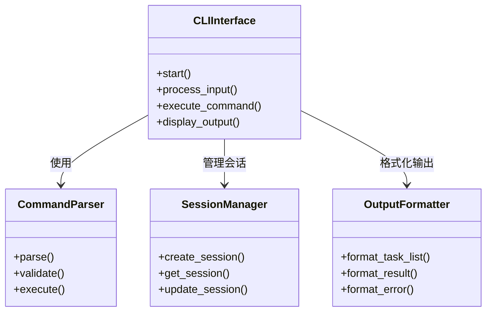
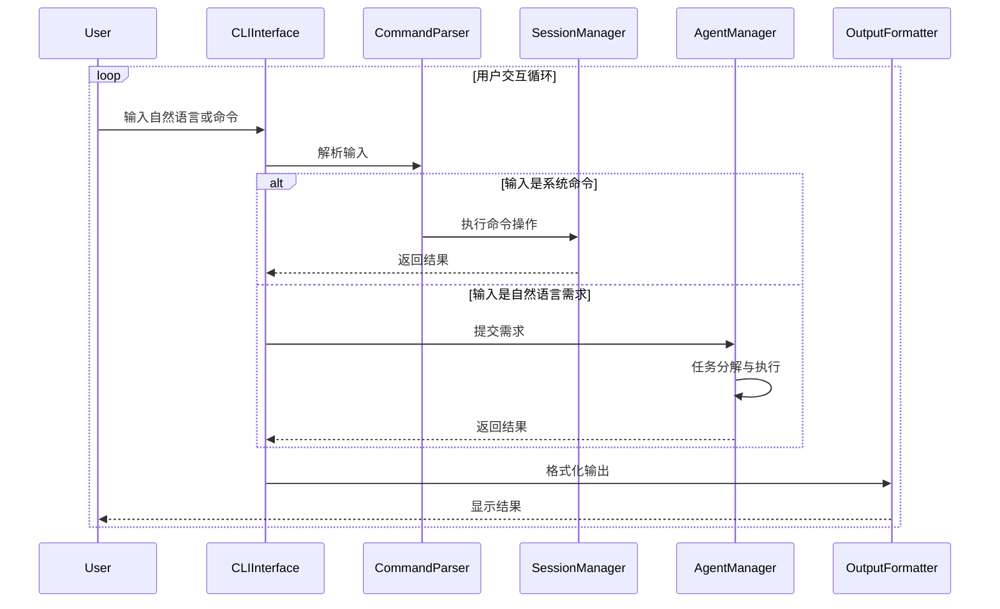

# 命令行交互模块设计文档

## 1. 模块概述
本模块实现基于Python argparse的命令行交互界面，负责用户输入接收、命令解析和输出展示。核心功能包括自然语言需求采集、任务状态展示、结果输出和交互式调试。

## 2. 模块职责
- 接收用户自然语言输入
- 解析和执行系统命令（/history, /config, /debug）
- 展示任务分解结果和执行进度
- 提供交互式调试模式
- 管理用户会话状态

## 3. 类图


## 4. 序列图


## 5. 接口定义
```python
class ICommandHandler:
    def handle_command(self, command: str, args: List[str]):
        """处理系统命令"""
    
    def supports_command(self, command: str) -> bool:
        """检查是否支持指定命令"""

class IInputProcessor:
    def process_input(self, raw_input: str) -> Dict:
        """处理原始用户输入"""
    
    def validate_input(self, input_data: Dict) -> bool:
        """验证输入数据有效性"""

class IOutputDisplay:
    def display_task_list(self, tasks: List[Dict]):
        """展示任务列表"""
    
    def display_result(self, result: Any):
        """展示执行结果"""
    
    def display_error(self, error: str):
        """展示错误信息"""
```

## 6. 数据结构
```json
{
  "user_input": {
    "raw": "string",
    "parsed": {
      "type": "command|query",
      "content": "string",
      "timestamp": "ISO8601"
    }
  },
  "command_response": {
    "command": "string",
    "status": "success|error",
    "output": "any",
    "metadata": {
      "execution_time": "number"
    }
  },
  "session_state": {
    "session_id": "string",
    "current_task": "string",
    "history": [
      {
        "input": "string",
        "output": "string"
      }
    ]
  }
}
```

## 7. 依赖关系
- 依赖Agent流程管理模块处理自然语言需求
- 与MCP工具管理模块共享会话状态
- 使用本地数据管理模块进行历史记录存储
- 为RAG知识管理模块提供交互式查询接口