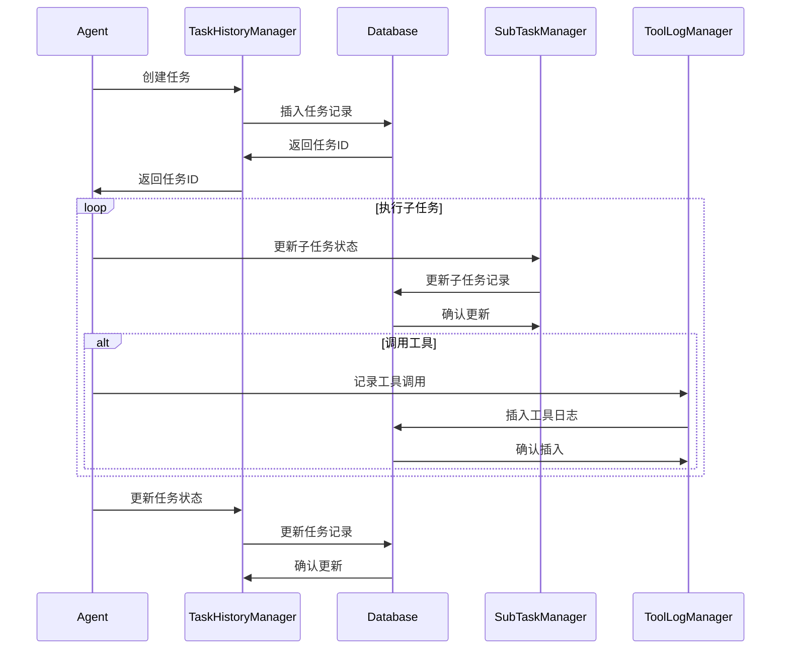
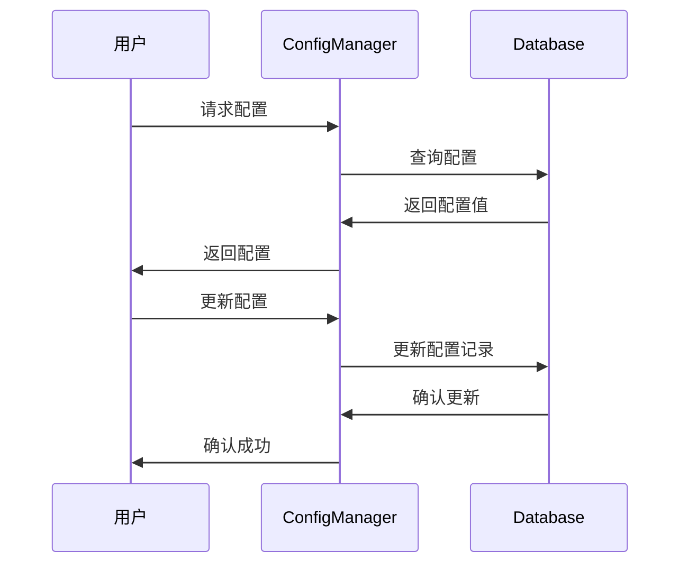

# 本地数据管理模块设计文档

## 模块概述

本地数据管理模块是AI Agent Flow系统的数据存储层，负责提供可靠的数据持久化服务。该模块基于SQLite3数据库实现，提供任务历史记录、用户配置、系统状态等数据的存储和检索功能，确保系统数据的完整性和一致性。

## 模块职责

1. **数据持久化**：提供可靠的数据存储服务
2. **任务历史管理**：记录和查询任务执行历史
3. **配置管理**：存储和管理系统配置参数
4. **状态跟踪**：维护系统运行状态信息
5. **数据备份**：支持数据备份和恢复功能
6. **性能优化**：提供高效的数据访问接口

## 核心组件

### 1. 数据库管理器 (DatabaseManager)

```python
import sqlite3
import json
from datetime import datetime
from typing import Dict, List, Any, Optional
from contextlib import contextmanager

class DatabaseManager:
    """数据库管理器，负责数据库连接和基本操作"""
    
    def __init__(self, db_path: str = "agent_flow.db"):
        self.db_path = db_path
        self._init_database()
    
    def _init_database(self):
        """初始化数据库表结构"""
        with self.get_connection() as conn:
            cursor = conn.cursor()
            
            # 创建任务历史表
            cursor.execute('''
                CREATE TABLE IF NOT EXISTS task_history (
                    task_id INTEGER PRIMARY KEY AUTOINCREMENT,
                    session_id TEXT NOT NULL,
                    user_input TEXT NOT NULL,
                    subtasks JSON,
                    results JSON,
                    status TEXT DEFAULT 'pending',
                    created_at DATETIME DEFAULT CURRENT_TIMESTAMP,
                    updated_at DATETIME DEFAULT CURRENT_TIMESTAMP
                )
            ''')
            
            # 创建子任务表
            cursor.execute('''
                CREATE TABLE IF NOT EXISTS subtasks (
                    subtask_id INTEGER PRIMARY KEY AUTOINCREMENT,
                    task_id INTEGER,
                    subtask_index INTEGER,
                    description TEXT NOT NULL,
                    expected_output TEXT,
                    actual_output TEXT,
                    status TEXT DEFAULT 'pending',
                    context JSON,
                    validation_report JSON,
                    created_at DATETIME DEFAULT CURRENT_TIMESTAMP,
                    updated_at DATETIME DEFAULT CURRENT_TIMESTAMP,
                    FOREIGN KEY (task_id) REFERENCES task_history (task_id)
                )
            ''')
            
            # 创建系统配置表
            cursor.execute('''
                CREATE TABLE IF NOT EXISTS system_config (
                    config_key TEXT PRIMARY KEY,
                    config_value TEXT,
                    description TEXT,
                    updated_at DATETIME DEFAULT CURRENT_TIMESTAMP
                )
            ''')
            
            # 创建用户配置表
            cursor.execute('''
                CREATE TABLE IF NOT EXISTS user_config (
                    user_id TEXT PRIMARY KEY,
                    preferences JSON,
                    api_keys JSON,
                    usage_stats JSON,
                    created_at DATETIME DEFAULT CURRENT_TIMESTAMP,
                    updated_at DATETIME DEFAULT CURRENT_TIMESTAMP
                )
            ''')
            
            # 创建知识源表
            cursor.execute('''
                CREATE TABLE IF NOT EXISTS knowledge_sources (
                    source_id INTEGER PRIMARY KEY AUTOINCREMENT,
                    source_name TEXT NOT NULL,
                    source_path TEXT NOT NULL,
                    source_type TEXT NOT NULL,
                    metadata JSON,
                    status TEXT DEFAULT 'active',
                    created_at DATETIME DEFAULT CURRENT_TIMESTAMP,
                    updated_at DATETIME DEFAULT CURRENT_TIMESTAMP
                )
            ''')
            
            # 创建工具调用日志表
            cursor.execute('''
                CREATE TABLE IF NOT EXISTS tool_logs (
                    log_id INTEGER PRIMARY KEY AUTOINCREMENT,
                    task_id INTEGER,
                    tool_name TEXT NOT NULL,
                    tool_args JSON,
                    tool_result JSON,
                    execution_time REAL,
                    status TEXT DEFAULT 'success',
                    error_message TEXT,
                    created_at DATETIME DEFAULT CURRENT_TIMESTAMP,
                    FOREIGN KEY (task_id) REFERENCES task_history (task_id)
                )
            ''')
            
            # 创建索引
            cursor.execute('CREATE INDEX IF NOT EXISTS idx_task_history_session ON task_history(session_id)')
            cursor.execute('CREATE INDEX IF NOT EXISTS idx_task_history_status ON task_history(status)')
            cursor.execute('CREATE INDEX IF NOT EXISTS idx_subtasks_task ON subtasks(task_id)')
            cursor.execute('CREATE INDEX IF NOT EXISTS idx_subtasks_status ON subtasks(status)')
            cursor.execute('CREATE INDEX IF NOT EXISTS idx_tool_logs_task ON tool_logs(task_id)')
            cursor.execute('CREATE INDEX IF NOT EXISTS idx_tool_logs_name ON tool_logs(tool_name)')
            
            conn.commit()
    
    @contextmanager
    def get_connection(self):
        """获取数据库连接的上下文管理器"""
        conn = sqlite3.connect(self.db_path)
        conn.row_factory = sqlite3.Row
        try:
            yield conn
        finally:
            conn.close()
    
    def execute_query(self, query: str, params: tuple = ()) -> List[Dict]:
        """执行查询并返回结果"""
        with self.get_connection() as conn:
            cursor = conn.cursor()
            cursor.execute(query, params)
            return [dict(row) for row in cursor.fetchall()]
    
    def execute_update(self, query: str, params: tuple = ()) -> int:
        """执行更新操作并返回影响的行数"""
        with self.get_connection() as conn:
            cursor = conn.cursor()
            cursor.execute(query, params)
            conn.commit()
            return cursor.rowcount
    
    def execute_insert(self, query: str, params: tuple = ()) -> int:
        """执行插入操作并返回最后插入的ID"""
        with self.get_connection() as conn:
            cursor = conn.cursor()
            cursor.execute(query, params)
            conn.commit()
            return cursor.lastrowid
```

### 2. 任务历史管理器 (TaskHistoryManager)

```python
class TaskHistoryManager:
    """任务历史管理器，负责任务历史的存储和查询"""
    
    def __init__(self, db_manager: DatabaseManager):
        self.db_manager = db_manager
    
    def create_task(self, session_id: str, user_input: str, subtasks: List[Dict]) -> int:
        """创建新任务记录"""
        query = '''
            INSERT INTO task_history (session_id, user_input, subtasks, status)
            VALUES (?, ?, ?, 'in_progress')
        '''
        task_id = self.db_manager.execute_insert(query, (session_id, user_input, json.dumps(subtasks)))
        
        # 创建子任务记录
        for i, subtask in enumerate(subtasks):
            self._create_subtask(task_id, i, subtask)
        
        return task_id
    
    def _create_subtask(self, task_id: int, subtask_index: int, subtask: Dict):
        """创建子任务记录"""
        query = '''
            INSERT INTO subtasks (task_id, subtask_index, description, expected_output, status)
            VALUES (?, ?, ?, ?, 'pending')
        '''
        self.db_manager.execute_insert(query, (
            task_id,
            subtask_index,
            subtask.get('description', ''),
            subtask.get('expected_output', '')
        ))
    
    def update_task_status(self, task_id: int, status: str, results: Optional[Dict] = None):
        """更新任务状态"""
        updates = ["status = ?", "updated_at = CURRENT_TIMESTAMP"]
        params = [status]
        
        if results is not None:
            updates.append("results = ?")
            params.append(json.dumps(results))
        
        query = f"UPDATE task_history SET {', '.join(updates)} WHERE task_id = ?"
        params.append(task_id)
        
        self.db_manager.execute_update(query, tuple(params))
    
    def update_subtask_status(self, subtask_id: int, status: str, actual_output: Optional[str] = None,
                            context: Optional[Dict] = None, validation_report: Optional[Dict] = None):
        """更新子任务状态"""
        updates = ["status = ?", "updated_at = CURRENT_TIMESTAMP"]
        params = [status]
        
        if actual_output is not None:
            updates.append("actual_output = ?")
            params.append(actual_output)
        
        if context is not None:
            updates.append("context = ?")
            params.append(json.dumps(context))
        
        if validation_report is not None:
            updates.append("validation_report = ?")
            params.append(json.dumps(validation_report))
        
        query = f"UPDATE subtasks SET {', '.join(updates)} WHERE subtask_id = ?"
        params.append(subtask_id)
        
        self.db_manager.execute_update(query, tuple(params))
    
    def get_task_history(self, session_id: Optional[str] = None, limit: int = 50) -> List[Dict]:
        """获取任务历史"""
        if session_id:
            query = '''
                SELECT * FROM task_history 
                WHERE session_id = ? 
                ORDER BY created_at DESC 
                LIMIT ?
            '''
            return self.db_manager.execute_query(query, (session_id, limit))
        else:
            query = '''
                SELECT * FROM task_history 
                ORDER BY created_at DESC 
                LIMIT ?
            '''
            return self.db_manager.execute_query(query, (limit,))
    
    def get_task_details(self, task_id: int) -> Dict:
        """获取任务详细信息"""
        # 获取任务基本信息
        task_query = "SELECT * FROM task_history WHERE task_id = ?"
        task = self.db_manager.execute_query(task_query, (task_id,))
        
        if not task:
            return {}
        
        task = task[0]
        
        # 获取子任务信息
        subtasks_query = "SELECT * FROM subtasks WHERE task_id = ? ORDER BY subtask_index"
        subtasks = self.db_manager.execute_query(subtasks_query, (task_id,))
        
        # 获取工具调用日志
        logs_query = "SELECT * FROM tool_logs WHERE task_id = ? ORDER BY created_at"
        logs = self.db_manager.execute_query(logs_query, (task_id,))
        
        return {
            'task': task,
            'subtasks': subtasks,
            'tool_logs': logs
        }
    
    def get_subtask_by_id(self, subtask_id: int) -> Dict:
        """根据ID获取子任务"""
        query = "SELECT * FROM subtasks WHERE subtask_id = ?"
        result = self.db_manager.execute_query(query, (subtask_id,))
        return result[0] if result else {}
    
    def get_tasks_by_status(self, status: str, limit: int = 50) -> List[Dict]:
        """根据状态获取任务"""
        query = '''
            SELECT * FROM task_history 
            WHERE status = ? 
            ORDER BY created_at DESC 
            LIMIT ?
        '''
        return self.db_manager.execute_query(query, (status, limit))
```

### 3. 配置管理器 (ConfigManager)

```python
class ConfigManager:
    """配置管理器，负责系统配置的存储和管理"""
    
    def __init__(self, db_manager: DatabaseManager):
        self.db_manager = db_manager
        self._init_default_config()
    
    def _init_default_config(self):
        """初始化默认配置"""
        default_configs = {
            "llm_model": "openai/gpt-4o",
            "llm_temperature": "0.7",
            "llm_max_tokens": "4000",
            "rag_enabled": "true",
            "rag_top_k": "5",
            "mcp_server_timeout": "30",
            "max_subtasks": "20",
            "info_gathering_max_rounds": "5",
            "auto_validation": "false",
            "log_level": "INFO"
        }
        
        for key, value in default_configs.items():
            self.set_config(key, value, f"Default {key} configuration")
    
    def set_config(self, key: str, value: str, description: str = ""):
        """设置配置项"""
        query = '''
            INSERT OR REPLACE INTO system_config (config_key, config_value, description, updated_at)
            VALUES (?, ?, ?, CURRENT_TIMESTAMP)
        '''
        self.db_manager.execute_update(query, (key, value, description))
    
    def get_config(self, key: str, default: Optional[str] = None) -> Optional[str]:
        """获取配置项"""
        query = "SELECT config_value FROM system_config WHERE config_key = ?"
        result = self.db_manager.execute_query(query, (key,))
        return result[0]['config_value'] if result else default
    
    def get_all_config(self) -> Dict[str, str]:
        """获取所有配置"""
        query = "SELECT config_key, config_value FROM system_config"
        results = self.db_manager.execute_query(query)
        return {row['config_key']: row['config_value'] for row in results}
    
    def delete_config(self, key: str):
        """删除配置项"""
        query = "DELETE FROM system_config WHERE config_key = ?"
        self.db_manager.execute_update(query, (key,))
```

### 4. 用户管理器 (UserManager)

```python
class UserManager:
    """用户管理器，负责用户配置和数据的存储"""
    
    def __init__(self, db_manager: DatabaseManager):
        self.db_manager = db_manager
    
    def create_user(self, user_id: str, preferences: Dict = None, api_keys: Dict = None):
        """创建用户"""
        query = '''
            INSERT INTO user_config (user_id, preferences, api_keys, usage_stats)
            VALUES (?, ?, ?, ?)
        '''
        self.db_manager.execute_insert(query, (
            user_id,
            json.dumps(preferences or {}),
            json.dumps(api_keys or {}),
            json.dumps({"task_count": 0, "total_tokens": 0})
        ))
    
    def update_user_preferences(self, user_id: str, preferences: Dict):
        """更新用户偏好设置"""
        query = '''
            UPDATE user_config 
            SET preferences = ?, updated_at = CURRENT_TIMESTAMP 
            WHERE user_id = ?
        '''
        affected = self.db_manager.execute_update(query, (json.dumps(preferences), user_id))
        return affected > 0
    
    def update_user_api_keys(self, user_id: str, api_keys: Dict):
        """更新用户API密钥"""
        query = '''
            UPDATE user_config 
            SET api_keys = ?, updated_at = CURRENT_TIMESTAMP 
            WHERE user_id = ?
        '''
        affected = self.db_manager.execute_update(query, (json.dumps(api_keys), user_id))
        return affected > 0
    
    def update_usage_stats(self, user_id: str, task_count: int = 0, tokens: int = 0):
        """更新用户使用统计"""
        # 获取当前统计
        current_stats = self.get_user_stats(user_id)
        
        # 更新统计
        new_stats = {
            "task_count": current_stats.get("task_count", 0) + task_count,
            "total_tokens": current_stats.get("total_tokens", 0) + tokens
        }
        
        query = '''
            UPDATE user_config 
            SET usage_stats = ?, updated_at = CURRENT_TIMESTAMP 
            WHERE user_id = ?
        '''
        affected = self.db_manager.execute_update(query, (json.dumps(new_stats), user_id))
        return affected > 0
    
    def get_user_preferences(self, user_id: str) -> Dict:
        """获取用户偏好设置"""
        query = "SELECT preferences FROM user_config WHERE user_id = ?"
        result = self.db_manager.execute_query(query, (user_id,))
        return json.loads(result[0]['preferences']) if result else {}
    
    def get_user_api_keys(self, user_id: str) -> Dict:
        """获取用户API密钥"""
        query = "SELECT api_keys FROM user_config WHERE user_id = ?"
        result = self.db_manager.execute_query(query, (user_id,))
        return json.loads(result[0]['api_keys']) if result else {}
    
    def get_user_stats(self, user_id: str) -> Dict:
        """获取用户使用统计"""
        query = "SELECT usage_stats FROM user_config WHERE user_id = ?"
        result = self.db_manager.execute_query(query, (user_id,))
        return json.loads(result[0]['usage_stats']) if result else {}
    
    def get_user_info(self, user_id: str) -> Dict:
        """获取用户完整信息"""
        query = "SELECT * FROM user_config WHERE user_id = ?"
        result = self.db_manager.execute_query(query, (user_id,))
        
        if not result:
            return {}
        
        user = result[0]
        return {
            "user_id": user["user_id"],
            "preferences": json.loads(user["preferences"]),
            "api_keys": json.loads(user["api_keys"]),
            "usage_stats": json.loads(user["usage_stats"]),
            "created_at": user["created_at"],
            "updated_at": user["updated_at"]
        }
```

### 5. 知识源管理器 (KnowledgeSourceManager)

```python
class KnowledgeSourceManager:
    """知识源管理器，负责知识源的存储和管理"""
    
    def __init__(self, db_manager: DatabaseManager):
        self.db_manager = db_manager
    
    def add_knowledge_source(self, name: str, path: str, source_type: str, metadata: Dict = None):
        """添加知识源"""
        query = '''
            INSERT INTO knowledge_sources (source_name, source_path, source_type, metadata)
            VALUES (?, ?, ?, ?)
        '''
        return self.db_manager.execute_insert(query, (
            name, path, source_type, json.dumps(metadata or {})
        ))
    
    def update_knowledge_source(self, source_id: int, **kwargs):
        """更新知识源"""
        updates = []
        params = []
        
        for key, value in kwargs.items():
            if key in ["source_name", "source_path", "source_type", "status"]:
                updates.append(f"{key} = ?")
                params.append(value)
            elif key == "metadata":
                updates.append("metadata = ?")
                params.append(json.dumps(value))
        
        if updates:
            updates.append("updated_at = CURRENT_TIMESTAMP")
            query = f"UPDATE knowledge_sources SET {', '.join(updates)} WHERE source_id = ?"
            params.append(source_id)
            return self.db_manager.execute_update(query, tuple(params))
        
        return 0
    
    def get_knowledge_source(self, source_id: int) -> Dict:
        """获取知识源"""
        query = "SELECT * FROM knowledge_sources WHERE source_id = ?"
        result = self.db_manager.execute_query(query, (source_id,))
        
        if not result:
            return {}
        
        source = result[0]
        return {
            "source_id": source["source_id"],
            "source_name": source["source_name"],
            "source_path": source["source_path"],
            "source_type": source["source_type"],
            "metadata": json.loads(source["metadata"]),
            "status": source["status"],
            "created_at": source["created_at"],
            "updated_at": source["updated_at"]
        }
    
    def get_all_knowledge_sources(self, status: str = "active") -> List[Dict]:
        """获取所有知识源"""
        query = "SELECT * FROM knowledge_sources WHERE status = ? ORDER BY created_at DESC"
        results = self.db_manager.execute_query(query, (status,))
        
        sources = []
        for result in results:
            sources.append({
                "source_id": result["source_id"],
                "source_name": result["source_name"],
                "source_path": result["source_path"],
                "source_type": result["source_type"],
                "metadata": json.loads(result["metadata"]),
                "status": result["status"],
                "created_at": result["created_at"],
                "updated_at": result["updated_at"]
            })
        
        return sources
    
    def delete_knowledge_source(self, source_id: int):
        """删除知识源"""
        query = "UPDATE knowledge_sources SET status = 'deleted', updated_at = CURRENT_TIMESTAMP WHERE source_id = ?"
        return self.db_manager.execute_update(query, (source_id,))
```

### 6. 工具日志管理器 (ToolLogManager)

```python
class ToolLogManager:
    """工具日志管理器，负责工具调用日志的存储和查询"""
    
    def __init__(self, db_manager: DatabaseManager):
        self.db_manager = db_manager
    
    def log_tool_call(self, task_id: int, tool_name: str, tool_args: Dict, 
                     tool_result: Dict, execution_time: float, status: str = "success",
                     error_message: str = None):
        """记录工具调用日志"""
        query = '''
            INSERT INTO tool_logs (task_id, tool_name, tool_args, tool_result, 
                                 execution_time, status, error_message)
            VALUES (?, ?, ?, ?, ?, ?, ?)
        '''
        return self.db_manager.execute_insert(query, (
            task_id, tool_name, json.dumps(tool_args), json.dumps(tool_result),
            execution_time, status, error_message
        ))
    
    def get_tool_logs(self, task_id: Optional[int] = None, tool_name: Optional[str] = None,
                      limit: int = 100) -> List[Dict]:
        """获取工具调用日志"""
        conditions = []
        params = []
        
        if task_id:
            conditions.append("task_id = ?")
            params.append(task_id)
        
        if tool_name:
            conditions.append("tool_name = ?")
            params.append(tool_name)
        
        where_clause = " AND ".join(conditions) if conditions else "1=1"
        
        query = f'''
            SELECT * FROM tool_logs 
            WHERE {where_clause} 
            ORDER BY created_at DESC 
            LIMIT ?
        '''
        params.append(limit)
        
        results = self.db_manager.execute_query(query, tuple(params))
        
        logs = []
        for result in results:
            logs.append({
                "log_id": result["log_id"],
                "task_id": result["task_id"],
                "tool_name": result["tool_name"],
                "tool_args": json.loads(result["tool_args"]),
                "tool_result": json.loads(result["tool_result"]),
                "execution_time": result["execution_time"],
                "status": result["status"],
                "error_message": result["error_message"],
                "created_at": result["created_at"]
            })
        
        return logs
    
    def get_tool_stats(self, tool_name: Optional[str] = None) -> Dict:
        """获取工具使用统计"""
        conditions = []
        params = []
        
        if tool_name:
            conditions.append("tool_name = ?")
            params.append(tool_name)
        
        where_clause = " AND ".join(conditions) if conditions else "1=1"
        
        # 总调用次数
        count_query = f"SELECT COUNT(*) as total_calls FROM tool_logs WHERE {where_clause}"
        total_calls = self.db_manager.execute_query(count_query, tuple(params))[0]['total_calls']
        
        # 成功调用次数
        success_query = f"SELECT COUNT(*) as success_calls FROM tool_logs WHERE {where_clause} AND status = 'success'"
        success_calls = self.db_manager.execute_query(success_query, tuple(params))[0]['success_calls']
        
        # 平均执行时间
        time_query = f"SELECT AVG(execution_time) as avg_time FROM tool_logs WHERE {where_clause}"
        avg_time = self.db_manager.execute_query(time_query, tuple(params))[0]['avg_time']
        
        return {
            "total_calls": total_calls,
            "success_calls": success_calls,
            "failure_calls": total_calls - success_calls,
            "success_rate": success_calls / total_calls if total_calls > 0 else 0,
            "avg_execution_time": avg_time or 0
        }
```

### 7. 数据备份管理器 (BackupManager)

```python
import shutil
import os
from datetime import datetime

class BackupManager:
    """数据备份管理器，负责数据备份和恢复"""
    
    def __init__(self, db_manager: DatabaseManager, backup_dir: str = "./backups"):
        self.db_manager = db_manager
        self.backup_dir = backup_dir
        os.makedirs(backup_dir, exist_ok=True)
    
    def create_backup(self, backup_name: Optional[str] = None) -> str:
        """创建数据备份"""
        if not backup_name:
            backup_name = f"backup_{datetime.now().strftime('%Y%m%d_%H%M%S')}"
        
        backup_path = os.path.join(self.backup_dir, backup_name)
        os.makedirs(backup_path, exist_ok=True)
        
        # 备份数据库文件
        db_backup_path = os.path.join(backup_path, "agent_flow.db")
        shutil.copy2(self.db_manager.db_path, db_backup_path)
        
        # 备份向量数据库（如果存在）
        chroma_path = "./chroma_db"
        if os.path.exists(chroma_path):
            chroma_backup_path = os.path.join(backup_path, "chroma_db")
            shutil.copytree(chroma_path, chroma_backup_path)
        
        # 创建备份信息文件
        backup_info = {
            "backup_name": backup_name,
            "created_at": datetime.now().isoformat(),
            "db_path": self.db_manager.db_path,
            "chroma_path": chroma_path if os.path.exists(chroma_path) else None
        }
        
        info_path = os.path.join(backup_path, "backup_info.json")
        with open(info_path, 'w') as f:
            json.dump(backup_info, f, indent=2)
        
        return backup_path
    
    def restore_backup(self, backup_path: str):
        """从备份恢复数据"""
        if not os.path.exists(backup_path):
            raise FileNotFoundError(f"Backup not found: {backup_path}")
        
        # 恢复数据库文件
        db_backup_path = os.path.join(backup_path, "agent_flow.db")
        if os.path.exists(db_backup_path):
            shutil.copy2(db_backup_path, self.db_manager.db_path)
        
        # 恢复向量数据库
        chroma_backup_path = os.path.join(backup_path, "chroma_db")
        if os.path.exists(chroma_backup_path):
            chroma_path = "./chroma_db"
            if os.path.exists(chroma_path):
                shutil.rmtree(chroma_path)
            shutil.copytree(chroma_backup_path, chroma_path)
    
    def list_backups(self) -> List[Dict]:
        """列出所有备份"""
        backups = []
        
        for item in os.listdir(self.backup_dir):
            backup_path = os.path.join(self.backup_dir, item)
            if os.path.isdir(backup_path):
                info_path = os.path.join(backup_path, "backup_info.json")
                if os.path.exists(info_path):
                    with open(info_path, 'r') as f:
                        backup_info = json.load(f)
                    backups.append(backup_info)
        
        return sorted(backups, key=lambda x: x['created_at'], reverse=True)
    
    def delete_backup(self, backup_name: str):
        """删除备份"""
        backup_path = os.path.join(self.backup_dir, backup_name)
        if os.path.exists(backup_path):
            shutil.rmtree(backup_path)
```

## 数据模型

### 1. 任务历史数据模型

```python
class TaskHistory:
    """任务历史数据模型"""
    
    def __init__(self, task_id: int, session_id: str, user_input: str, 
                 subtasks: List[Dict], results: Dict, status: str,
                 created_at: str, updated_at: str):
        self.task_id = task_id
        self.session_id = session_id
        self.user_input = user_input
        self.subtasks = subtasks
        self.results = results
        self.status = status
        self.created_at = created_at
        self.updated_at = updated_at
```

### 2. 子任务数据模型

```python
class SubTask:
    """子任务数据模型"""
    
    def __init__(self, subtask_id: int, task_id: int, subtask_index: int,
                 description: str, expected_output: str, actual_output: str,
                 status: str, context: Dict, validation_report: Dict,
                 created_at: str, updated_at: str):
        self.subtask_id = subtask_id
        self.task_id = task_id
        self.subtask_index = subtask_index
        self.description = description
        self.expected_output = expected_output
        self.actual_output = actual_output
        self.status = status
        self.context = context
        self.validation_report = validation_report
        self.created_at = created_at
        self.updated_at = updated_at
```

## 工作流程

### 1. 任务执行数据流



### 2. 配置管理流程



## 配置参数

### 1. 数据库配置

```python
DATABASE_CONFIG = {
    "db_path": "agent_flow.db",
    "backup_dir": "./backups",
    "auto_backup": True,
    "backup_interval": 86400,  # 24小时
    "max_backups": 30,
    "connection_timeout": 30,
    "query_timeout": 10
}
```

### 2. 表结构配置

```python
TABLE_CONFIG = {
    "task_history": {
        "indexes": ["session_id", "status", "created_at"],
        "partition_by": "session_id"
    },
    "subtasks": {
        "indexes": ["task_id", "status", "subtask_index"],
        "foreign_keys": ["task_id"]
    },
    "tool_logs": {
        "indexes": ["task_id", "tool_name", "status", "created_at"],
        "foreign_keys": ["task_id"]
    }
}
```

## 错误处理

### 1. 数据库错误

```python
class DatabaseError(Exception):
    """数据库错误"""
    pass

class ConnectionError(Exception):
    """连接错误"""
    pass

class QueryError(Exception):
    """查询错误"""
    pass

class TransactionError(Exception):
    """事务错误"""
    pass
```

### 2. 数据完整性错误

```python
class DataIntegrityError(Exception):
    """数据完整性错误"""
    pass

class ConstraintViolationError(Exception):
    """约束违反错误"""
    pass

class ForeignKeyError(Exception):
    """外键错误"""
    pass
```

### 3. 备份错误

```python
class BackupError(Exception):
    """备份错误"""
    pass

class RestoreError(Exception):
    """恢复错误"""
    pass

class BackupNotFoundError(Exception):
    """备份未找到错误"""
    pass
```

## 性能优化

### 1. 索引优化

- 为常用查询字段创建索引
- 使用复合索引优化复杂查询
- 定期分析和优化索引性能

### 2. 查询优化

- 使用参数化查询防止SQL注入
- 优化复杂查询的执行计划
- 实现查询结果缓存

### 3. 连接管理

- 使用连接池管理数据库连接
- 实现连接超时和重试机制
- 优化长事务的处理

## 安全考虑

### 1. 数据加密

- 敏感数据加密存储
- 实现数据传输加密
- 支持密钥轮换

### 2. 访问控制

- 实现基于角色的访问控制
- 记录数据访问日志
- 支持数据脱敏

### 3. 备份安全

- 备份文件加密
- 安全的备份存储位置
- 备份访问权限控制

## 测试策略

### 1. 单元测试

- 测试数据库操作
- 验证数据模型
- 测试错误处理

### 2. 集成测试

- 测试完整的数据流
- 验证事务处理
- 测试并发访问

### 3. 性能测试

- 测试大规模数据处理
- 验证查询性能
- 测试并发访问能力

## 扩展性考虑

### 1. 多数据库支持

- 支持PostgreSQL、MySQL等数据库
- 实现数据库抽象层
- 支持数据库迁移

### 2. 分布式存储

- 支持分布式数据库
- 实现数据分片
- 支持读写分离

### 3. 数据同步

- 实现数据同步机制
- 支持多节点数据一致性
- 实现冲突解决策略
