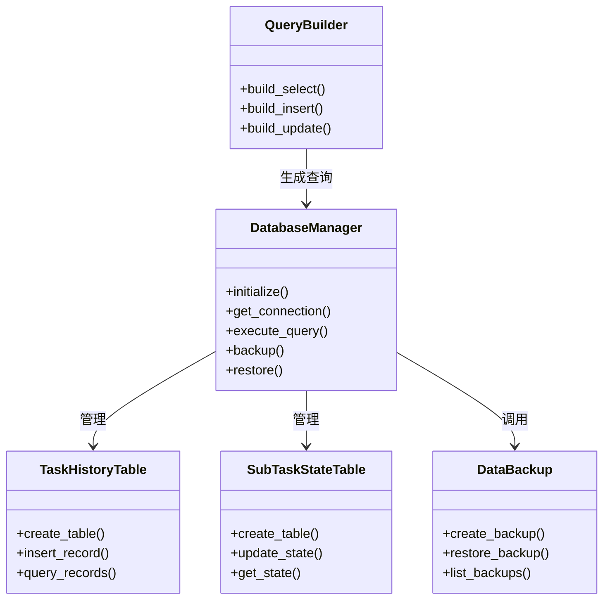
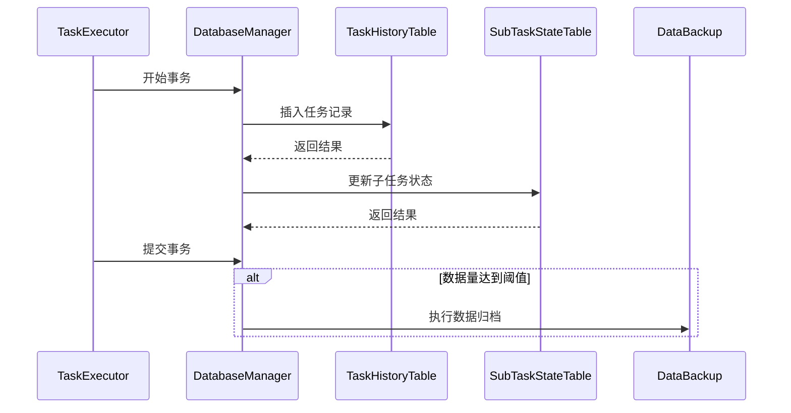

# 本地数据管理模块设计文档

## 1. 模块概述
本模块实现基于SQLite3的本地数据持久化管理，负责任务历史记录、子任务状态和执行结果的存储与检索。核心功能包括结构化数据存储、事务管理、数据备份和快速检索。

## 2. 模块职责
- 定义数据库表结构（任务历史、子任务状态、执行结果）
- 实现数据库连接池管理
- 提供事务支持的数据操作接口
- 实现数据备份与恢复机制
- 支持任务数据的快速检索与清理

## 3. 类图


## 4. 序列图


## 5. 接口定义
```sql
-- 任务历史表
CREATE TABLE task_history (
    task_id INTEGER PRIMARY KEY,
    user_input TEXT NOT NULL,
    subtasks JSON NOT NULL,
    results BLOB,
    timestamp DATETIME DEFAULT CURRENT_TIMESTAMP
);

-- 子任务状态表
CREATE TABLE subtask_state (
    subtask_id INTEGER PRIMARY KEY,
    task_id INTEGER NOT NULL,
    state INTEGER NOT NULL CHECK(state BETWEEN 0 AND 4),
    context JSON,
    FOREIGN KEY(task_id) REFERENCES task_history(task_id)
);

-- 数据库操作接口
class IDatabaseManager:
    def execute(self, query: str, params: tuple = None) -> List[Dict]:
        """执行SQL查询"""
    
    def executemany(self, query: str, params: List[tuple]):
        """批量执行SQL操作"""
    
    def backup(self, backup_path: str):
        """创建数据库备份"""
    
    def restore(self, backup_path: str):
        """从备份恢复数据库"""
```

## 6. 数据结构
```json
{
  "task_record": {
    "task_id": "integer",
    "user_input": "string",
    "subtasks": [
      {
        "id": "string",
        "description": "string",
        "status": "SubTaskState",
        "execution_plan": {
          "tool": "string",
          "parameters": "object"
        }
      }
    ],
    "results": "base64",
    "timestamp": "ISO8601"
  },
  "query_result": {
    "columns": ["string"],
    "rows": [["any"]]
  }
}
```

## 7. 依赖关系
- 依赖Agent流程管理模块获取任务状态变更
- 为RAG知识管理模块提供持久化支持
- 与MCP工具管理模块共享数据库连接
- 使用标准库实现文件操作和事务管理