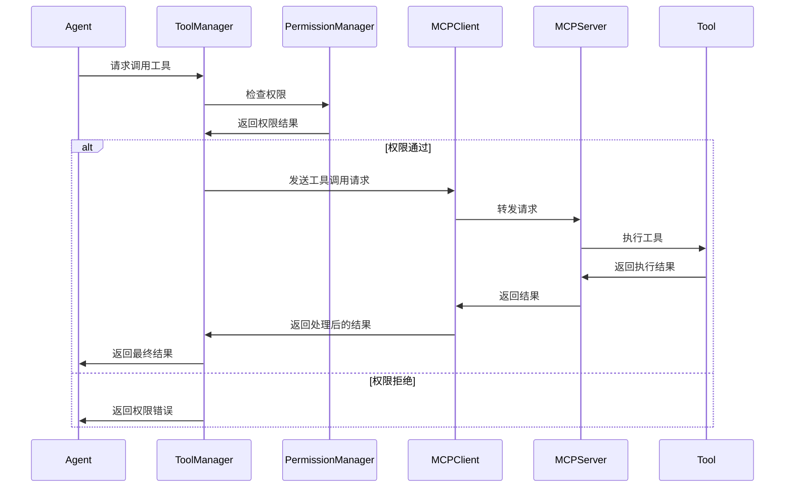
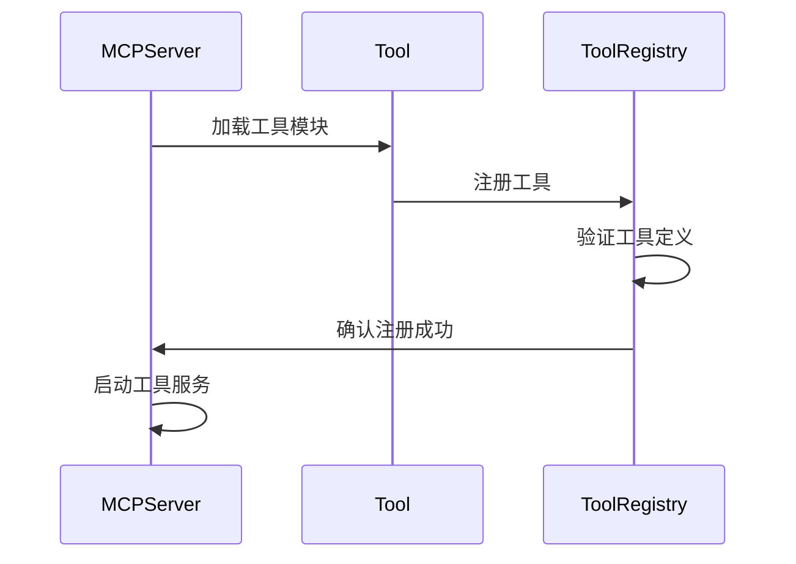

# MCP工具管理模块设计文档

## 模块概述

MCP工具管理模块是AI Agent Flow系统的工具协议层，负责管理和协调各种工具的调用。该模块基于MCP (Model Context Protocol) SDK实现，提供统一的工具接口和协议转换能力，支持文件操作、代码生成、UML生成等多种工具功能。

## 模块职责

1. **工具注册**：注册和管理各种工具服务
2. **协议转换**：将Agent请求转换为MCP协议格式
3. **工具调用**：执行具体的工具操作并返回结果
4. **权限管理**：控制工具访问权限和安全策略
5. **结果处理**：格式化和返回工具执行结果

## 核心组件

### 1. MCP服务端 (MCPServer)

```python
from mcp.server.fastmcp import FastMCP

class MCPServer:
    """MCP服务端，负责提供工具服务"""
    
    def __init__(self, name="ai-agent-flow-tools"):
        self.mcp = FastMCP(name)
        self.tools = {}
        self._register_tools()
    
    def _register_tools(self):
        """注册所有工具"""
        self._register_file_tools()
        self._register_code_tools()
        self._register_uml_tools()
        self._register_database_tools()
    
    def _register_file_tools(self):
        """注册文件操作工具"""
        @self.mcp.tool()
        def list_files(confirm: bool) -> List[str]:
            """获取当前目录文件列表（需用户确认）"""
            pass
        
        @self.mcp.tool()
        def read_file(file_path: str) -> str:
            """读取文件内容"""
            pass
        
        @self.mcp.tool()
        def write_file(file_path: str, content: str) -> str:
            """写入文件内容"""
            pass
    
    def _register_code_tools(self):
        """注册代码生成工具"""
        @self.mcp.tool()
        def generate_code(language: str, requirements: str) -> str:
            """生成指定语言的代码"""
            pass
        
        @self.mcp.tool()
        def execute_code(code: str) -> str:
            """执行代码并返回结果"""
            pass
    
    def _register_uml_tools(self):
        """注册UML生成工具"""
        @self.mcp.tool()
        def generate_class_diagram(classes: List[dict]) -> str:
            """生成类图"""
            pass
        
        @self.mcp.tool()
        def generate_sequence_diagram(interactions: List[dict]) -> str:
            """生成序列图"""
            pass
    
    def _register_database_tools(self):
        """注册数据库操作工具"""
        @self.mcp.tool()
        def query_database(query: str) -> List[dict]:
            """执行数据库查询"""
            pass
        
        @self.mcp.tool()
        def update_database(table: str, data: dict) -> str:
            """更新数据库记录"""
            pass
    
    def run(self, transport='stdio'):
        """启动MCP服务"""
        self.mcp.run(transport=transport)
```

### 2. MCP客户端 (MCPClient)

```python
from mcp import Client
from mcp.client.stdio import stdio_client

class MCPClient:
    """MCP客户端，负责与MCP服务端通信"""
    
    def __init__(self, server_config):
        self.server_config = server_config
        self.client = None
        self.tools = []
    
    async def connect(self):
        """连接到MCP服务端"""
        async with stdio_client(self.server_config) as (read, write):
            async with Client(read, write) as client:
                await client.initialize()
                self.client = client
                self.tools = await client.list_tools()
    
    async def call_tool(self, tool_name: str, arguments: dict):
        """调用工具"""
        if not self.client:
            raise ConnectionError("MCP客户端未连接")
        
        result = await self.client.call_tool(tool_name, arguments)
        return result
    
    async def list_tools(self):
        """获取可用工具列表"""
        if not self.client:
            raise ConnectionError("MCP客户端未连接")
        
        return await self.client.list_tools()
    
    def get_tool_schemas(self):
        """获取工具模式"""
        return [tool.inputSchema for tool in self.tools]
```

### 3. 工具管理器 (ToolManager)

```python
class ToolManager:
    """工具管理器，负责工具的统一管理和调用"""
    
    def __init__(self, mcp_client):
        self.mcp_client = mcp_client
        self.tool_cache = {}
        self.permission_manager = PermissionManager()
    
    async def initialize(self):
        """初始化工具管理器"""
        await self.mcp_client.connect()
        await self._cache_tools()
    
    async def _cache_tools(self):
        """缓存工具信息"""
        tools = await self.mcp_client.list_tools()
        for tool in tools:
            self.tool_cache[tool.name] = {
                'schema': tool.inputSchema,
                'description': getattr(tool, 'description', '')
            }
    
    async def execute_tool(self, tool_name: str, arguments: dict):
        """执行工具"""
        # 检查权限
        if not self.permission_manager.check_permission(tool_name, arguments):
            raise PermissionError(f"无权限调用工具: {tool_name}")
        
        # 验证参数
        self._validate_arguments(tool_name, arguments)
        
        # 调用工具
        result = await self.mcp_client.call_tool(tool_name, arguments)
        
        # 处理结果
        return self._process_result(result)
    
    def _validate_arguments(self, tool_name: str, arguments: dict):
        """验证工具参数"""
        if tool_name not in self.tool_cache:
            raise ValueError(f"未知工具: {tool_name}")
        
        schema = self.tool_cache[tool_name]['schema']
        # 实现参数验证逻辑
        pass
    
    def _process_result(self, result):
        """处理工具执行结果"""
        # 实现结果处理逻辑
        return result
    
    def get_available_tools(self):
        """获取可用工具列表"""
        return list(self.tool_cache.keys())
    
    def get_tool_description(self, tool_name: str):
        """获取工具描述"""
        return self.tool_cache.get(tool_name, {}).get('description', '')
```

### 4. 权限管理器 (PermissionManager)

```python
class PermissionManager:
    """权限管理器，负责工具访问权限控制"""
    
    def __init__(self):
        self.permissions = {
            'file_operations': {
                'list_files': 'user_confirm',
                'read_file': 'user_confirm',
                'write_file': 'user_confirm'
            },
            'code_operations': {
                'generate_code': 'auto',
                'execute_code': 'user_confirm'
            },
            'uml_operations': {
                'generate_class_diagram': 'auto',
                'generate_sequence_diagram': 'auto'
            },
            'database_operations': {
                'query_database': 'auto',
                'update_database': 'user_confirm'
            }
        }
    
    def check_permission(self, tool_name: str, arguments: dict):
        """检查工具调用权限"""
        # 根据工具类型确定权限级别
        permission_level = self._get_permission_level(tool_name)
        
        if permission_level == 'auto':
            return True
        elif permission_level == 'user_confirm':
            # 需要用户确认
            return self._request_user_confirmation(tool_name, arguments)
        else:
            return False
    
    def _get_permission_level(self, tool_name: str):
        """获取工具权限级别"""
        for category, tools in self.permissions.items():
            if tool_name in tools:
                return tools[tool_name]
        return 'user_confirm'  # 默认需要用户确认
    
    def _request_user_confirmation(self, tool_name: str, arguments: dict):
        """请求用户确认"""
        # 实现用户确认逻辑
        return True
    
    def set_permission(self, tool_name: str, level: str):
        """设置工具权限级别"""
        for category, tools in self.permissions.items():
            if tool_name in tools:
                tools[tool_name] = level
                return True
        return False
```

## 工具实现

### 1. 文件操作工具

```python
class FileTools:
    """文件操作工具集"""
    
    @staticmethod
    def list_files(confirm: bool) -> List[str]:
        """获取当前目录文件列表"""
        if not confirm:
            raise PermissionError("需要用户确认才能获取文件列表")
        
        try:
            return os.listdir('.')
        except Exception as e:
            raise FileOperationError(f"获取文件列表失败: {str(e)}")
    
    @staticmethod
    def read_file(file_path: str) -> str:
        """读取文件内容"""
        try:
            with open(file_path, 'r', encoding='utf-8') as f:
                return f.read()
        except Exception as e:
            raise FileOperationError(f"读取文件失败: {str(e)}")
    
    @staticmethod
    def write_file(file_path: str, content: str) -> str:
        """写入文件内容"""
        try:
            # 确保目录存在
            os.makedirs(os.path.dirname(file_path), exist_ok=True)
            
            with open(file_path, 'w', encoding='utf-8') as f:
                f.write(content)
            
            return f"文件已成功写入: {file_path}"
        except Exception as e:
            raise FileOperationError(f"写入文件失败: {str(e)}")
```

### 2. 代码生成工具

```python
class CodeTools:
    """代码生成工具集"""
    
    @staticmethod
    def generate_code(language: str, requirements: str) -> str:
        """生成指定语言的代码"""
        # 调用大模型生成代码
        prompt = f"""
        请根据以下要求生成{language}代码：
        
        要求：{requirements}
        
        请提供完整、可执行的代码。
        """
        
        # 调用LLM生成代码
        llm = get_llm_instance()
        response = llm.generate(prompt)
        
        return response
    
    @staticmethod
    def execute_code(code: str) -> str:
        """执行代码并返回结果"""
        try:
            # 创建临时文件
            with tempfile.NamedTemporaryFile(mode='w', suffix='.py', delete=False) as f:
                f.write(code)
                temp_file = f.name
            
            # 执行代码
            result = subprocess.run(
                ['python', temp_file],
                capture_output=True,
                text=True,
                timeout=30
            )
            
            # 清理临时文件
            os.unlink(temp_file)
            
            if result.returncode == 0:
                return result.stdout
            else:
                return f"执行错误: {result.stderr}"
                
        except subprocess.TimeoutExpired:
            return "代码执行超时"
        except Exception as e:
            return f"执行失败: {str(e)}"
```

### 3. UML生成工具

```python
class UMLTools:
    """UML生成工具集"""
    
    @staticmethod
    def generate_class_diagram(classes: List[dict]) -> str:
        """生成类图"""
        mermaid_code = ["classDiagram"]
        
        for cls in classes:
            class_name = cls.get('name', 'UnknownClass')
            mermaid_code.append(f"    class {class_name}")
            
            # 添加属性
            for attr in cls.get('attributes', []):
                mermaid_code.append(f"    {class_name} : {attr}")
            
            # 添加方法
            for method in cls.get('methods', []):
                mermaid_code.append(f"    {class_name} : {method}()")
        
        # 添加关系
        for cls in classes:
            class_name = cls.get('name', 'UnknownClass')
            for relation in cls.get('relations', []):
                target = relation.get('target', '')
                relation_type = relation.get('type', '-->')
                mermaid_code.append(f"    {class_name} {relation_type} {target}")
        
        return "\n".join(mermaid_code)
    
    @staticmethod
    def generate_sequence_diagram(interactions: List[dict]) -> str:
        """生成序列图"""
        mermaid_code = ["sequenceDiagram"]
        
        for interaction in interactions:
            actor = interaction.get('actor', 'Actor')
            target = interaction.get('target', 'Target')
            message = interaction.get('message', 'Message')
            mermaid_code.append(f"    {actor}->>{target}: {message}")
        
        return "\n".join(mermaid_code)
```

### 4. 数据库操作工具

```python
class DatabaseTools:
    """数据库操作工具集"""
    
    def __init__(self, db_path: str = "agent_flow.db"):
        self.db_path = db_path
        self._init_database()
    
    def _init_database(self):
        """初始化数据库"""
        conn = sqlite3.connect(self.db_path)
        cursor = conn.cursor()
        
        # 创建任务历史表
        cursor.execute('''
            CREATE TABLE IF NOT EXISTS task_history (
                task_id INTEGER PRIMARY KEY,
                user_input TEXT,
                subtasks JSON,
                results BLOB,
                timestamp DATETIME DEFAULT CURRENT_TIMESTAMP
            )
        ''')
        
        conn.commit()
        conn.close()
    
    def query_database(self, query: str) -> List[dict]:
        """执行数据库查询"""
        try:
            conn = sqlite3.connect(self.db_path)
            cursor = conn.cursor()
            
            cursor.execute(query)
            columns = [description[0] for description in cursor.description]
            rows = cursor.fetchall()
            
            conn.close()
            
            # 转换为字典列表
            result = []
            for row in rows:
                result.append(dict(zip(columns, row)))
            
            return result
            
        except Exception as e:
            raise DatabaseError(f"数据库查询失败: {str(e)}")
    
    def update_database(self, table: str, data: dict) -> str:
        """更新数据库记录"""
        try:
            conn = sqlite3.connect(self.db_path)
            cursor = conn.cursor()
            
            # 构建INSERT语句
            columns = ', '.join(data.keys())
            placeholders = ', '.join(['?' for _ in data])
            values = list(data.values())
            
            query = f"INSERT INTO {table} ({columns}) VALUES ({placeholders})"
            cursor.execute(query, values)
            
            conn.commit()
            conn.close()
            
            return f"数据已成功插入到表 {table}"
            
        except Exception as e:
            raise DatabaseError(f"数据库更新失败: {str(e)}")
```

## 工作流程

### 1. 工具调用流程



### 2. 工具注册流程



## 配置参数

### 1. MCP服务端配置

```python
MCP_SERVER_CONFIG = {
    "name": "ai-agent-flow-tools",
    "transport": "stdio",
    "tools": {
        "file_operations": {
            "enabled": True,
            "max_file_size": "10MB",
            "allowed_extensions": [".py", ".md", ".txt", ".json"]
        },
        "code_operations": {
            "enabled": True,
            "execution_timeout": 30,
            "allowed_languages": ["python", "javascript", "java"]
        },
        "uml_operations": {
            "enabled": True,
            "max_classes": 50,
            "max_interactions": 100
        },
        "database_operations": {
            "enabled": True,
            "db_path": "agent_flow.db",
            "max_query_time": 10
        }
    }
}
```

### 2. MCP客户端配置

```python
MCP_CLIENT_CONFIG = {
    "server": {
        "command": "python",
        "args": ["mcp_server.py"]
    },
    "connection": {
        "timeout": 30,
        "retry_attempts": 3,
        "retry_delay": 1
    },
    "caching": {
        "enabled": True,
        "ttl": 300
    }
}
```

## 错误处理

### 1. MCP协议错误

```python
class MCPProtocolError(Exception):
    """MCP协议错误"""
    pass

class MCPConnectionError(Exception):
    """MCP连接错误"""
    pass
```

### 2. 工具执行错误

```python
class ToolExecutionError(Exception):
    """工具执行错误"""
    pass

class ToolTimeoutError(Exception):
    """工具执行超时错误"""
    pass
```

### 3. 权限错误

```python
class PermissionError(Exception):
    """权限错误"""
    pass

class SecurityViolationError(Exception):
    """安全违规错误"""
    pass
```

## 安全考虑

### 1. 权限控制

- 实现基于工具类型的权限分级
- 支持用户确认机制
- 记录工具调用日志

### 2. 输入验证

- 验证工具参数的合法性
- 限制文件操作范围
- 防止代码注入攻击

### 3. 资源限制

- 限制工具执行时间
- 控制文件大小
- 限制数据库查询复杂度

## 性能优化

### 1. 连接池管理

- 复用MCP连接
- 实现连接超时处理
- 支持连接健康检查

### 2. 结果缓存

- 缓存工具调用结果
- 实现缓存失效策略
- 支持缓存预热

### 3. 异步处理

- 支持异步工具调用
- 实现并发工具执行
- 优化I/O操作

## 测试策略

### 1. 单元测试

- 测试各个工具的功能
- 验证权限控制逻辑
- 测试错误处理机制

### 2. 集成测试

- 测试MCP客户端和服务端通信
- 验证工具调用流程
- 测试权限管理集成

### 3. 系统测试

- 测试端到端的工具调用
- 验证系统稳定性
- 测试性能和资源使用

## 扩展性考虑

### 1. 插件化工具

- 支持动态加载工具
- 实现工具生命周期管理
- 支持工具版本控制

### 2. 多协议支持

- 支持多种通信协议
- 实现协议适配器
- 支持自定义协议

### 3. 分布式部署

- 支持工具服务分布式部署
- 实现负载均衡
- 支持服务发现
