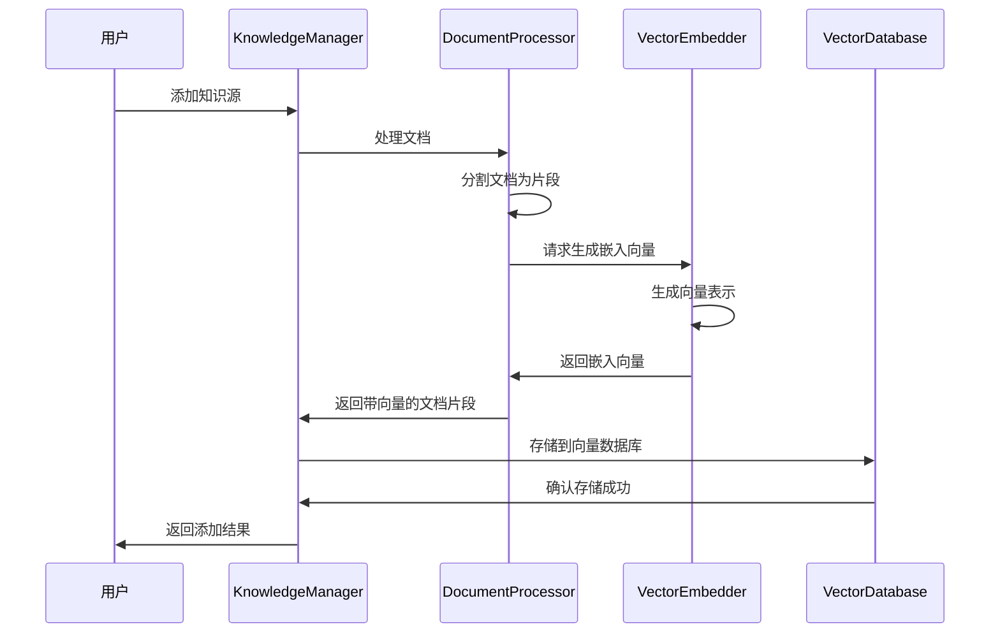
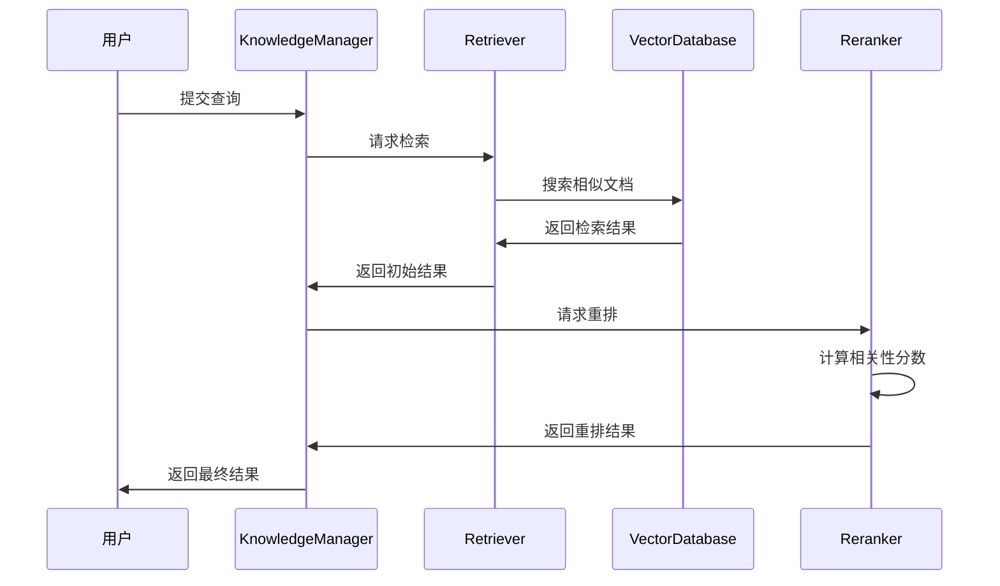

# RAG知识管理模块设计文档

## 模块概述

RAG（Retrieval-Augmented Generation）知识管理模块是AI Agent Flow系统的知识增强层，负责提供智能化的知识检索和增强能力。该模块通过向量嵌入、相似性检索和相关性重排等技术，为系统提供准确、相关的知识支持，增强大模型的回答质量和专业性。

## 模块职责

1. **知识库管理**：维护和更新知识库内容
2. **文档处理**：将技术文档、代码范例和工具手册转换为可检索的格式
3. **向量嵌入**：将文本内容转换为向量表示
4. **相似性检索**：基于查询检索相关知识片段
5. **相关性重排**：对检索结果进行相关性排序
6. **知识增强**：为Agent提供上下文相关的知识支持

## 核心组件

### 1. 文档处理器 (DocumentProcessor)

```python
class DocumentProcessor:
    """文档处理器，负责将各种格式的文档转换为可检索的文本片段"""
    
    def __init__(self, chunk_size=1000, chunk_overlap=200):
        self.chunk_size = chunk_size
        self.chunk_overlap = chunk_overlap
        self.supported_formats = ['.md', '.txt', '.py', '.js', '.json']
    
    def process_document(self, file_path: str) -> List[str]:
        """处理单个文档，返回文本片段列表"""
        if not self._is_supported_format(file_path):
            raise UnsupportedFormatError(f"不支持的文件格式: {file_path}")
        
        content = self._extract_text(file_path)
        chunks = self._split_into_chunks(content)
        
        # 添加元数据
        chunks_with_metadata = []
        for i, chunk in enumerate(chunks):
            metadata = {
                'source': file_path,
                'chunk_id': i,
                'total_chunks': len(chunks)
            }
            chunks_with_metadata.append({
                'content': chunk,
                'metadata': metadata
            })
        
        return chunks_with_metadata
    
    def _is_supported_format(self, file_path: str) -> bool:
        """检查文件格式是否支持"""
        return any(file_path.endswith(ext) for ext in self.supported_formats)
    
    def _extract_text(self, file_path: str) -> str:
        """从文件中提取文本内容"""
        try:
            with open(file_path, 'r', encoding='utf-8') as f:
                return f.read()
        except Exception as e:
            raise DocumentProcessingError(f"提取文本失败: {str(e)}")
    
    def _split_into_chunks(self, content: str) -> List[str]:
        """将文本内容分割为片段"""
        # 使用简单的段落分割策略
        paragraphs = content.split('\n\n')
        chunks = []
        current_chunk = ""
        
        for paragraph in paragraphs:
            if len(current_chunk) + len(paragraph) + 2 <= self.chunk_size:
                current_chunk += paragraph + '\n\n'
            else:
                if current_chunk:
                    chunks.append(current_chunk.strip())
                current_chunk = paragraph + '\n\n'
        
        if current_chunk:
            chunks.append(current_chunk.strip())
        
        return chunks
```

### 2. 向量嵌入器 (VectorEmbedder)

```python
from sentence_transformers import SentenceTransformer
import numpy as np

class VectorEmbedder:
    """向量嵌入器，负责将文本转换为向量表示"""
    
    def __init__(self, model_name="moka-ai/m3e-small"):
        self.model = SentenceTransformer(model_name)
        self.dimension = self.model.get_sentence_embedding_dimension()
    
    def embed_text(self, text: str) -> List[float]:
        """将单个文本转换为向量"""
        try:
            embedding = self.model.encode(text, normalize_embeddings=True)
            return embedding.tolist()
        except Exception as e:
            raise EmbeddingError(f"文本嵌入失败: {str(e)}")
    
    def embed_batch(self, texts: List[str]) -> List[List[float]]:
        """批量将文本转换为向量"""
        try:
            embeddings = self.model.encode(texts, normalize_embeddings=True)
            return embeddings.tolist()
        except Exception as e:
            raise EmbeddingError(f"批量文本嵌入失败: {str(e)}")
    
    def compute_similarity(self, embedding1: List[float], embedding2: List[float]) -> float:
        """计算两个向量之间的余弦相似度"""
        try:
            vec1 = np.array(embedding1)
            vec2 = np.array(embedding2)
            
            cosine_similarity = np.dot(vec1, vec2) / (np.linalg.norm(vec1) * np.linalg.norm(vec2))
            return float(cosine_similarity)
        except Exception as e:
            raise SimilarityComputationError(f"相似度计算失败: {str(e)}")
```

### 3. 向量数据库 (VectorDatabase)

```python
import chromadb
from chromadb.config import Settings

class VectorDatabase:
    """向量数据库，负责存储和检索向量嵌入"""
    
    def __init__(self, collection_name="agent_flow_knowledge", persist_directory="./chroma_db"):
        self.client = chromadb.PersistentClient(path=persist_directory)
        self.collection_name = collection_name
        self.collection = self._get_or_create_collection()
    
    def _get_or_create_collection(self):
        """获取或创建集合"""
        try:
            return self.client.get_or_create_collection(
                name=self.collection_name,
                metadata={"hnsw:space": "cosine"}
            )
        except Exception as e:
            raise DatabaseError(f"创建集合失败: {str(e)}")
    
    def add_documents(self, documents: List[dict]):
        """添加文档到向量数据库"""
        try:
            # 提取内容、元数据和嵌入向量
            contents = [doc['content'] for doc in documents]
            metadatas = [doc['metadata'] for doc in documents]
            embeddings = [doc['embedding'] for doc in documents]
            ids = [f"{doc['metadata']['source']}_{doc['metadata']['chunk_id']}" for doc in documents]
            
            # 添加到集合
            self.collection.add(
                documents=contents,
                metadatas=metadatas,
                embeddings=embeddings,
                ids=ids
            )
        except Exception as e:
            raise DatabaseError(f"添加文档失败: {str(e)}")
    
    def search(self, query_embedding: List[float], top_k: int = 5) -> List[dict]:
        """搜索相似的文档"""
        try:
            results = self.collection.query(
                query_embeddings=[query_embedding],
                n_results=top_k
            )
            
            # 格式化结果
            formatted_results = []
            for i in range(len(results['ids'][0])):
                formatted_results.append({
                    'id': results['ids'][0][i],
                    'content': results['documents'][0][i],
                    'metadata': results['metadatas'][0][i],
                    'distance': results['distances'][0][i]
                })
            
            return formatted_results
        except Exception as e:
            raise DatabaseError(f"搜索失败: {str(e)}")
    
    def delete_by_source(self, source: str):
        """根据源文件删除文档"""
        try:
            # 获取所有文档
            all_docs = self.collection.get()
            
            # 找出需要删除的文档ID
            ids_to_delete = []
            for i, metadata in enumerate(all_docs['metadatas']):
                if metadata.get('source') == source:
                    ids_to_delete.append(all_docs['ids'][i])
            
            # 删除文档
            if ids_to_delete:
                self.collection.delete(ids=ids_to_delete)
        except Exception as e:
            raise DatabaseError(f"删除文档失败: {str(e)}")
    
    def get_collection_stats(self) -> dict:
        """获取集合统计信息"""
        try:
            count = self.collection.count()
            return {
                'total_documents': count,
                'collection_name': self.collection_name
            }
        except Exception as e:
            raise DatabaseError(f"获取统计信息失败: {str(e)}")
```

### 4. 检索器 (Retriever)

```python
class Retriever:
    """检索器，负责基于查询检索相关知识"""
    
    def __init__(self, vector_db: VectorDatabase, embedder: VectorEmbedder):
        self.vector_db = vector_db
        self.embedder = embedder
    
    def retrieve(self, query: str, top_k: int = 5) -> List[dict]:
        """基于查询检索相关知识"""
        try:
            # 将查询转换为向量
            query_embedding = self.embedder.embed_text(query)
            
            # 搜索相似文档
            results = self.vector_db.search(query_embedding, top_k)
            
            return results
        except Exception as e:
            raise RetrievalError(f"检索失败: {str(e)}")
    
    def retrieve_with_filter(self, query: str, filter_dict: dict, top_k: int = 5) -> List[dict]:
        """基于查询和过滤器检索相关知识"""
        try:
            # 将查询转换为向量
            query_embedding = self.embedder.embed_text(query)
            
            # 构建过滤条件
            where_clause = {}
            for key, value in filter_dict.items():
                where_clause[key] = value
            
            # 搜索相似文档
            results = self.vector_db.search_with_filter(query_embedding, where_clause, top_k)
            
            return results
        except Exception as e:
            raise RetrievalError(f"带过滤器的检索失败: {str(e)}")
```

### 5. 重排器 (Reranker)

```python
from sentence_transformers import CrossEncoder

class Reranker:
    """重排器，负责对检索结果进行相关性重排"""
    
    def __init__(self, model_name="cross-encoder/mmarco-mMiniLMv2-L12-H384-v1"):
        self.model = CrossEncoder(model_name)
    
    def rerank(self, query: str, documents: List[dict], top_k: int = 3) -> List[dict]:
        """对检索结果进行相关性重排"""
        try:
            # 提取文档内容
            doc_contents = [doc['content'] for doc in documents]
            
            # 构建查询-文档对
            pairs = [(query, doc_content) for doc_content in doc_contents]
            
            # 计算相关性分数
            scores = self.model.predict(pairs)
            
            # 将分数与文档关联
            scored_docs = []
            for doc, score in zip(documents, scores):
                scored_doc = doc.copy()
                scored_doc['rerank_score'] = float(score)
                scored_docs.append(scored_doc)
            
            # 按分数排序
            scored_docs.sort(key=lambda x: x['rerank_score'], reverse=True)
            
            # 返回前top_k个结果
            return scored_docs[:top_k]
        except Exception as e:
            raise RerankingError(f"重排失败: {str(e)}")
```

### 6. 知识管理器 (KnowledgeManager)

```python
class KnowledgeManager:
    """知识管理器，负责协调整个RAG流程"""
    
    def __init__(self, config: dict):
        self.config = config
        self.document_processor = DocumentProcessor(
            chunk_size=config.get('chunk_size', 1000),
            chunk_overlap=config.get('chunk_overlap', 200)
        )
        self.embedder = VectorEmbedder(config.get('embedding_model', "moka-ai/m3e-small"))
        self.vector_db = VectorDatabase(
            collection_name=config.get('collection_name', "agent_flow_knowledge"),
            persist_directory=config.get('persist_directory', "./chroma_db")
        )
        self.retriever = Retriever(self.vector_db, self.embedder)
        self.reranker = Reranker(config.get('reranker_model', "cross-encoder/mmarco-mMiniLMv2-L12-H384-v1"))
    
    def add_knowledge_source(self, source_path: str):
        """添加知识源"""
        try:
            # 处理文档
            documents = self.document_processor.process_document(source_path)
            
            # 为每个文档生成嵌入向量
            for doc in documents:
                doc['embedding'] = self.embedder.embed_text(doc['content'])
            
            # 添加到向量数据库
            self.vector_db.add_documents(documents)
            
            return f"成功添加知识源: {source_path}"
        except Exception as e:
            raise KnowledgeManagementError(f"添加知识源失败: {str(e)}")
    
    def retrieve_knowledge(self, query: str, top_k: int = 5, use_rerank: bool = True) -> List[dict]:
        """检索相关知识"""
        try:
            # 初始检索
            results = self.retriever.retrieve(query, top_k)
            
            # 如果需要重排
            if use_rerank and results:
                results = self.reranker.rerank(query, results, min(top_k, len(results)))
            
            return results
        except Exception as e:
            raise KnowledgeManagementError(f"检索知识失败: {str(e)}")
    
    def update_knowledge_base(self, source_path: str):
        """更新知识库"""
        try:
            # 删除旧的文档
            self.vector_db.delete_by_source(source_path)
            
            # 添加新的文档
            return self.add_knowledge_source(source_path)
        except Exception as e:
            raise KnowledgeManagementError(f"更新知识库失败: {str(e)}")
    
    def get_knowledge_stats(self) -> dict:
        """获取知识库统计信息"""
        try:
            return self.vector_db.get_collection_stats()
        except Exception as e:
            raise KnowledgeManagementError(f"获取统计信息失败: {str(e)}")
```

## 工作流程

### 1. 知识库构建流程



### 2. 知识检索流程



## 配置参数

### 1. RAG系统配置

```python
RAG_CONFIG = {
    "document_processing": {
        "chunk_size": 1000,
        "chunk_overlap": 200,
        "supported_formats": [".md", ".txt", ".py", ".js", ".json"]
    },
    "embedding": {
        "model_name": "moka-ai/m3e-small",
        "normalize_embeddings": True
    },
    "vector_database": {
        "collection_name": "agent_flow_knowledge",
        "persist_directory": "./chroma_db",
        "distance_metric": "cosine"
    },
    "reranking": {
        "model_name": "cross-encoder/mmarco-mMiniLMv2-L12-H384-v1",
        "top_k": 3
    },
    "retrieval": {
        "default_top_k": 5,
        "min_similarity_score": 0.5,
        "use_reranking": True
    }
}
```

### 2. 知识源配置

```python
KNOWLEDGE_SOURCES = {
    "technical_docs": {
        "path": "./knowledge/technical_docs",
        "description": "技术文档",
        "priority": 1
    },
    "code_examples": {
        "path": "./knowledge/code_examples",
        "description": "代码示例",
        "priority": 2
    },
    "tool_manuals": {
        "path": "./knowledge/tool_manuals",
        "description": "工具手册",
        "priority": 3
    }
}
```

## 错误处理

### 1. 文档处理错误

```python
class DocumentProcessingError(Exception):
    """文档处理错误"""
    pass

class UnsupportedFormatError(Exception):
    """不支持的格式错误"""
    pass
```

### 2. 嵌入错误

```python
class EmbeddingError(Exception):
    """嵌入错误"""
    pass

class SimilarityComputationError(Exception):
    """相似度计算错误"""
    pass
```

### 3. 数据库错误

```python
class DatabaseError(Exception):
    """数据库错误"""
    pass

class CollectionNotFoundError(Exception):
    """集合未找到错误"""
    pass
```

### 4. 检索错误

```python
class RetrievalError(Exception):
    """检索错误"""
    pass

class RerankingError(Exception):
    """重排错误"""
    pass
```

### 5. 知识管理错误

```python
class KnowledgeManagementError(Exception):
    """知识管理错误"""
    pass

class KnowledgeSourceError(Exception):
    """知识源错误"""
    pass
```

## 性能优化

### 1. 批量处理

- 支持批量文档处理
- 实现批量向量嵌入
- 优化数据库批量操作

### 2. 缓存机制

- 缓存常用查询结果
- 实现嵌入向量缓存
- 支持预计算相似度

### 3. 索引优化

- 使用高效的向量索引
- 实现分层检索策略
- 支持近似最近邻搜索

## 测试策略

### 1. 单元测试

- 测试文档处理功能
- 验证向量嵌入准确性
- 测试数据库操作

### 2. 集成测试

- 测试完整的RAG流程
- 验证检索质量
- 测试重排效果

### 3. 性能测试

- 测试大规模知识库处理
- 验证检索速度
- 测试内存使用情况

## 扩展性考虑

### 1. 多模态支持

- 支持图像、音频等多模态数据
- 实现多模态嵌入模型
- 支持跨模态检索

### 2. 分布式部署

- 支持分布式向量数据库
- 实现分布式检索
- 支持负载均衡

### 3. 知识图谱集成

- 集成知识图谱技术
- 实现结构化知识检索
- 支持推理和问答
