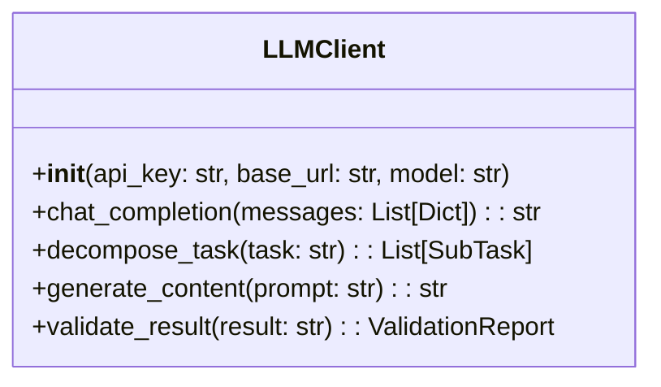
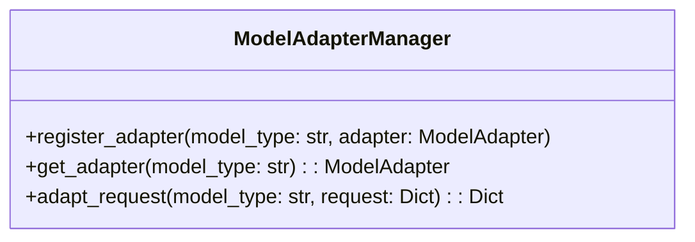
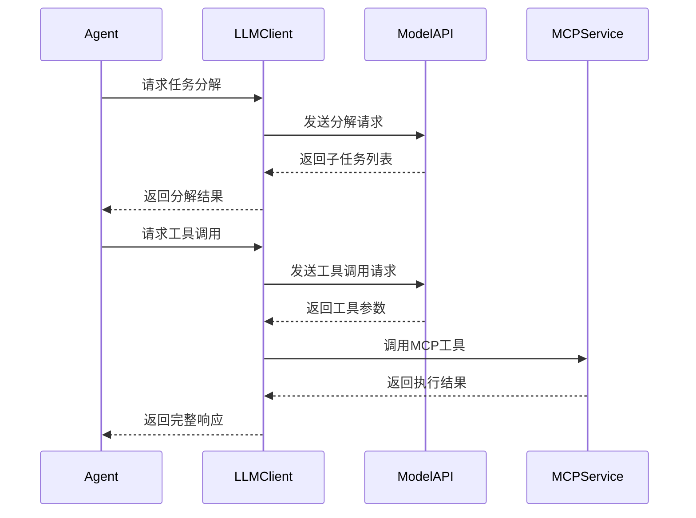
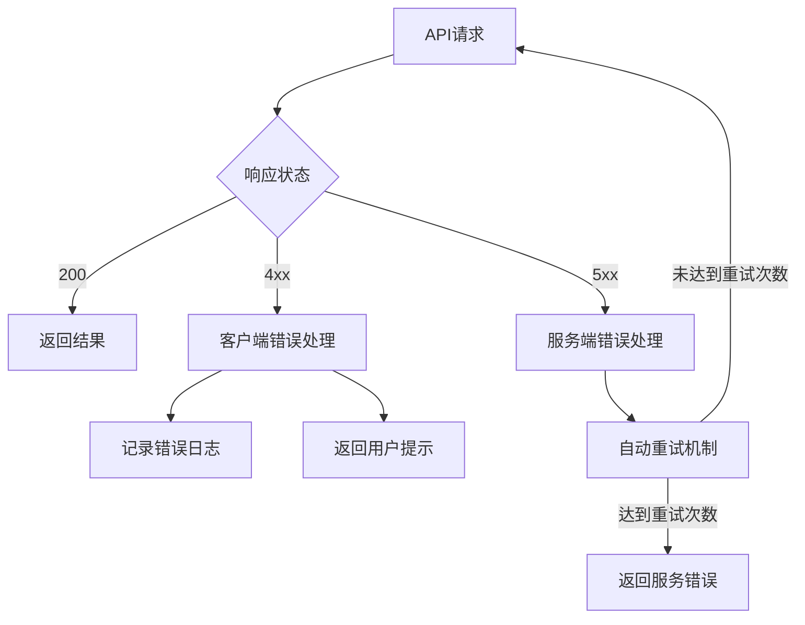

# 大模型接口模块详细设计文档

## 1. 模块职责
- 提供统一的大模型交互接口
- 支持多模型供应商（OpenAI兼容接口）
- 实现任务分解与内容生成能力
- 维护模型配置管理
- 处理API请求与错误恢复

## 2. 核心组件设计

### 2.1 LLMClient


### 2.2 ModelAdapterManager


## 3. 交互流程设计


## 4. 配置管理
```python
# llm/client.py
import os
from typing import Dict, Any

class LLMConfig:
    def __init__(self):
        self.api_key = os.getenv("LLM_API_KEY")
        self.base_url = os.getenv("LLM_BASE_URL", "https://api.openai.com/v1")
        self.model = os.getenv("LLM_MODEL", "gpt-4o-mini")
        self.timeout = int(os.getenv("LLM_TIMEOUT", "30"))
        self.max_retries = int(os.getenv("LLM_RETRIES", "3"))

class LLMClient:
    def __init__(self, config: LLMConfig):
        self.config = config
        self.session = self._init_session()
        
    def _init_session(self):
        # 初始化API会话
        return requests.Session()
```

## 5. 错误处理策略


## 6. 安全机制
- API密钥隔离：通过环境变量注入，不硬编码在代码中
- 请求签名：对敏感请求进行数字签名验证
- 速率限制：客户端和服务端双重重试控制
- 内容过滤：输入输出内容的安全检查
- 审计日志：记录所有API调用和响应结果