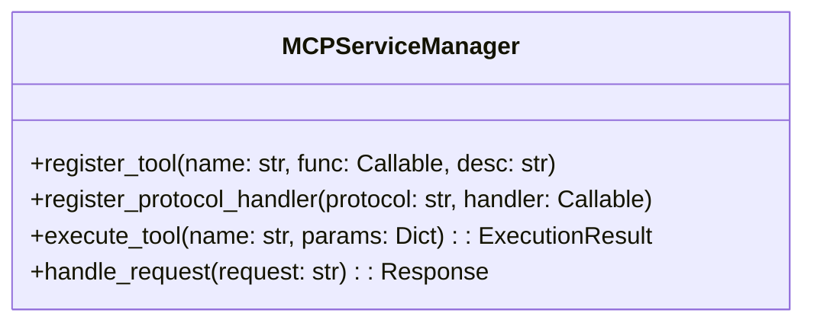
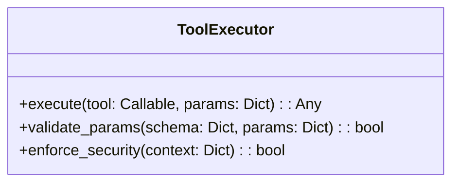
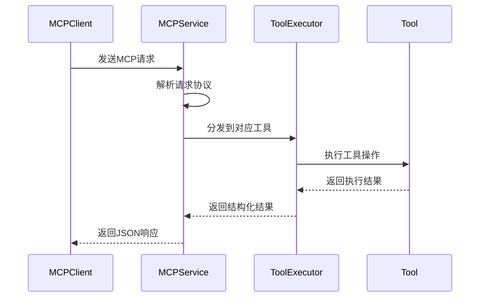

# MCP服务模块详细设计文档

## 1. 模块职责
- 提供MCP工具注册与管理功能
- 实现协议解析与路由处理
- 支持多工具并行执行
- 维护工具执行上下文管理
- 提供扩展接口支持新工具开发

## 2. 核心组件设计

### 2.1 MCPServiceManager


### 2.2 ToolExecutor


## 3. 协议处理流程


## 4. 扩展性设计
```python
# mcp/service.py
class DatabaseTool:
    """示例扩展工具"""
    def __init__(self, connection_string):
        self.conn = sqlite3.connect(connection_string)
    
    def execute_query(self, query):
        cursor = self.conn.cursor()
        cursor.execute(query)
        return cursor.fetchall()

# 使用示例
db_tool = DatabaseTool("data.db")
mcp_service.register_tool(
    name="database",
    tool_func=db_tool.execute_query,
    description="执行SQL查询的数据库工具"
)
```

## 5. 安全机制
- 请求验证：JSON Schema校验
- 上下文隔离：每个请求独立执行上下文
- 超时控制：工具执行时间限制
- 权限验证：基于请求来源的权限检查

## 6. 错误处理策略
```mermaid
graph TD
    A[收到请求] --> B{验证通过?}
    B -->|是| C[执行工具]
    B -->|否| D[返回400错误]
    C --> E{执行成功?}
    E -->|是| F[返回结果]
    E -->|否| G[记录错误日志]
    G --> H[返回500错误]