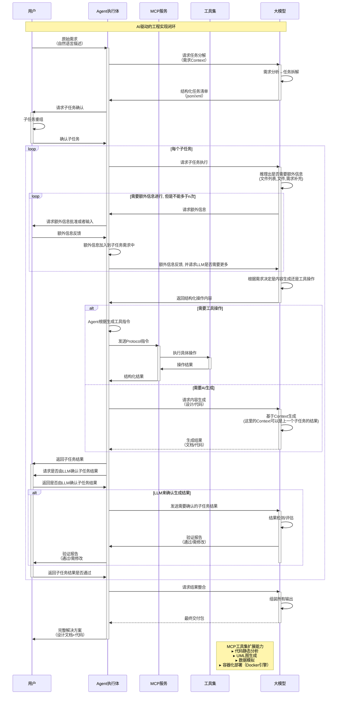

# ai agent flow

## requirement

1. 根据下面的流程图 生成出合适的python程序
    * 架构清晰, 包含如下模块:

        * Agent 以及agent flow管理
        * MCP 注册和管理
        * 大模型交互接口
        * 本地数据管理
        * rag管理
        * 命令行交互
        * 其他

    * 逻辑清晰
    * 可读性强
    * 命令行交互即可, 但是输入输出要完备

2. 使用下面的组件作为基础架构:

    * 使用openai的兼容api通大模型进行对话, 可以修改base_url和模型名还有api_key
    * 使用crewAI 作为agent flow管理 , 设计可以参考代码 finance_crew.py
    * 使用MCP SDK 来管理mcp工具, 客户端用mcp, 服务端用fastMCP 
        * client 参考 mcp_client_for_llm.py
        * server 参考 mcp_server.py
    * RAG使用 参考 rag.py
    * 使用sqlLite3作为本地数据管理

3. 根据生成的脚本生成合适的文档, 文档路径写到doc文件夹下
    * 详细设计文档
    * 系统架构图
    * UML图

4. 请根据需求先计划好作业的步骤

5. 新增功能:
    * 在子任务执行前, 加入大模型推理步骤, 根据推理结果来决定是否同用户进行交互来或取额外的信息.额外信息指的是:
        用户用自然语言补充的信息
        用户提交的数据或者其他信息
        同用户请求当前文件夹的所有文件(使用mcp工具, 询问用户是否同意即可)
        同用户请求打开某个文件(使用mcp工具, 询问用户是否同意即可)
        额外信息的推理可以循环, 因为或取文件夹内容后,一般需要或取文件内容. 但是不超过5次

6. 所有任务完成后, 你要转变为资深系统工程师, 对整个系统的代码进行检查

## flow

