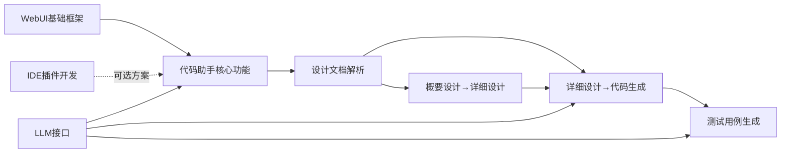

任务文件整合分析及结构化任务框架，涵盖功能模块、技术实现和优先级：

---

### **一、核心功能域整合**
| **功能大类**               | **子模块**                  | **关键任务**                                                                 | **来源文档**       | **优先级** |
|----------------------------|----------------------------|-----------------------------------------------------------------------------|--------------------|------------|
| **1. WebUI开发**           | 前端设计                   | 注册/登录/主页/模型配置/项目操作/模型交互等10+页面设计                         | 李光鑫-Solution1   | 高         |
|                            | 后端支撑                   | 用户认证(JWT)、文件存储(Local/S3)、API开发、文件解析(复杂Excel)                | 李光鑫-Solution1   | 高         |
|                            | 代码助手功能               | 文件读写/搜索/Todo管理/工具调用/LLM对接/提示词工程                            | 吴桐-功能点1       | 高         |
| **2. 设计文档驱动开发**     | 详细设计→代码生成          | 解析Markdown设计书 → 分模块生成代码 → 质量检查(接口一致性/单元测试)             | 吴桐-功能点2       | 高         |
|                            | 概要设计→详细设计          | Excel解析 → Markdown转换 → 细化模块接口 → 生成详细设计书                       | 吴桐-功能点4       | 中         |
| **3. 测试用例生成**        | 设计书→测试用例            | 从设计书提取原子功能 → 匹配测试模板 → 生成Excel测试用例                        | 吴桐-功能点3       | 低         |
| **4. IDE插件方案**         | 插件功能                   | 模型选择/上下文编辑/文件操作命令                                              | 李光鑫-Solution2   | 中         |
| **5. LLM集成**             | 模型管理                   | 本地/云模型接入、VLMs多模态支持、响应解析                                     | 李光鑫-LLM部分     | 高         |

---

### **二、关键技术栈与实现难点**
| **技术方向**       | **任务项**                                                                 | **挑战点**                                                                 | **优先级** |
|--------------------|---------------------------------------------------------------------------|---------------------------------------------------------------------------|------------|
| **文件存储**       | 选型：Local(挂载存储卷) vs S3/minio                                      | 本地部署兼容性、性能优化                                                  | 高         |
| **文件解析**       | - Excel→Markdown转换(Openpyxl/Pandas)<br>- 复杂表格/流程图解析(VLMs)     | 非结构化表格识别、多模态模型精度                                          | 高         |
| **代码索引**       | - AST解析(Tree-sitter+WASM)<br>- LLM文件摘要(JSON/Qdrant向量库)           | 冷门语言支持(VB/Cobol)、索引实时更新                                      | 高         |
| **提示词工程**     | - 系统提示词设计<br>- 工具描述模板<br>- 场景适配提示词                    | 复杂任务拆解、工具调用准确性                                              | 高         |
| **上下文管理**     | 对话压缩/历史筛选/超长上下文处理                                          | Token优化、关键信息保留                                                   | 高         |
| **冲突解决**       | 文件状态跟踪(外部修改检测/版本管理)                                       | 实时协同冲突控制                                                          | 中         |

---

### **三、任务依赖与优先级矩阵**


**优先级说明：**
- **P0（高）**：WebUI前后端、代码读写/搜索/工具调用、LLM对接、Markdown设计书解析
- **P1（中）**：IDE插件、冷门语言AST支持、Excel解析优化、设计书版本管理
- **P2（低）**：测试用例生成、增量修改功能

---

### **四、关键发现与优化建议**
1. **功能重叠**：  
   - 李光鑫的 **WebUI模型交互页面** 与吴桐的 **代码模式(ask/edit)** 需统一交互逻辑（如上下文拖拽功能）。
   - 双方均提及 **文件存储方案**（Local/S3），需明确选型标准。

2. **技术缺口**：  
   - 吴桐要求的 **VB/Cobol语言支持** 在AST解析中缺乏方案，需评估Tree-sitter扩展成本。
   - **Excel多模态解析** 依赖VLMs，但李光鑫文档中VLMs仅处于调研阶段。

3. **优先级冲突**：  
   - 吴桐将 **文件搜索（基于索引）** 标为中优先级，但此功能直接影响代码助手效率，建议提升。

4. **可复用组件**：  
   - 提示词模板（参考Roo-Code）、工具描述（`roo-code/src/core/tools`）可直接复用。

---

### **五、执行路线图**
```plaintext
Phase 1：基础能力搭建
  - WebUI前端页面 + 后端认证/API框架 
  - 文件存储方案落地（Local优先）
  - 代码读写/搜索/Todo工具开发
  - LLM基础对接（GPT/本地模型）

Phase 2：核心功能实现
  - Markdown设计书解析 → 代码生成
  - 代码摘要索引（AST+LLM双方案）
  - 提示词工程标准化

Phase 3：扩展能力
  - IDE插件开发
  - Excel→Markdown转换工具
  - 测试用例生成（依赖详细设计书成熟后）
```

> **风险提示**：Excel解析、冷门语言支持、设计书版本管理是潜在延期因素，建议分阶段验证可行性。