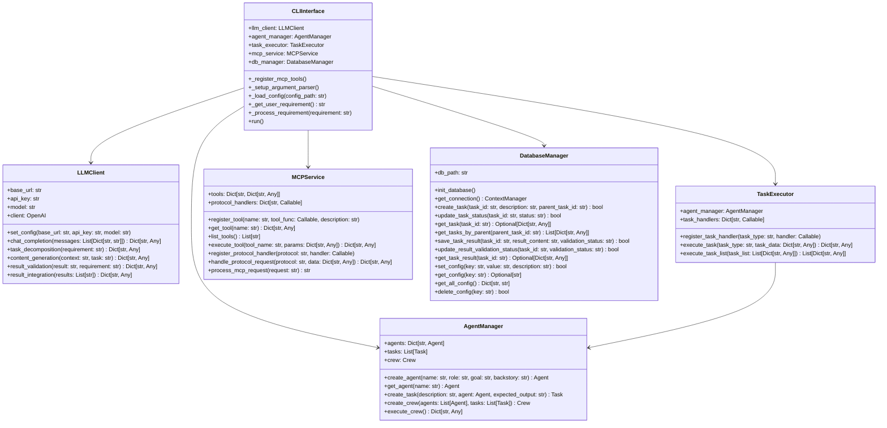
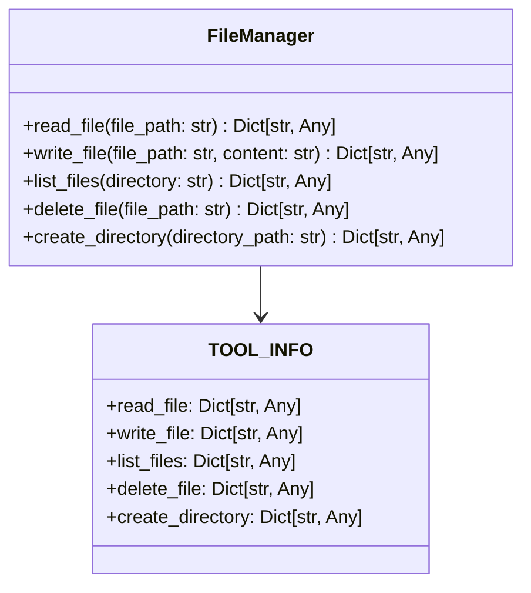
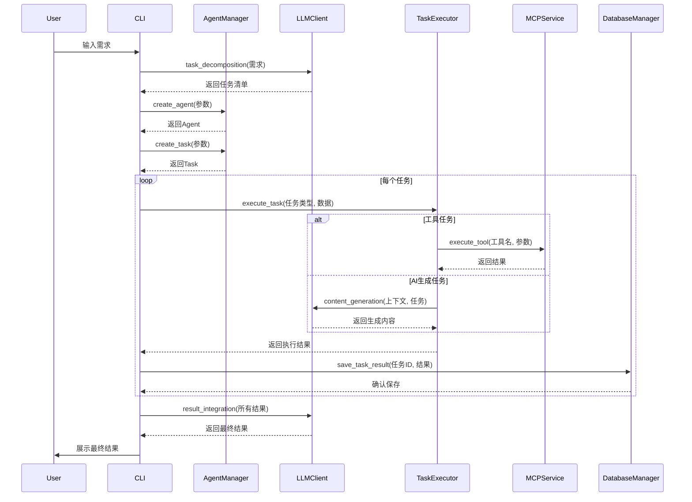
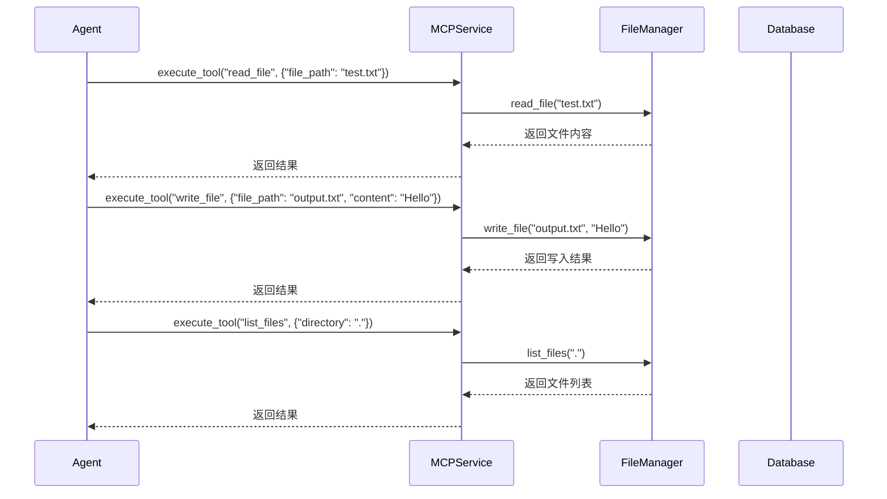
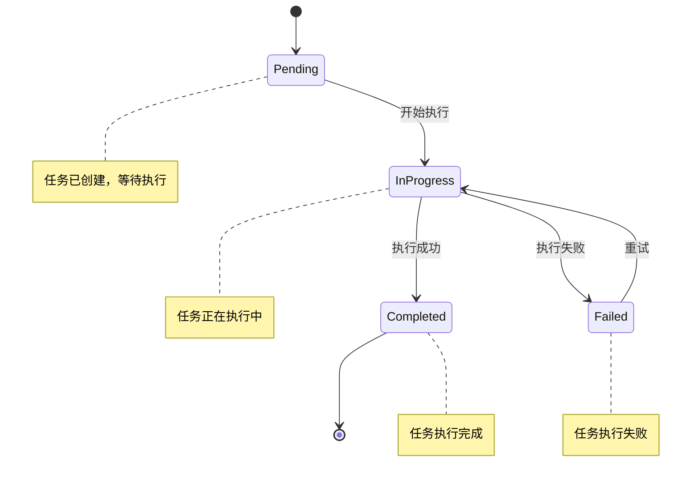
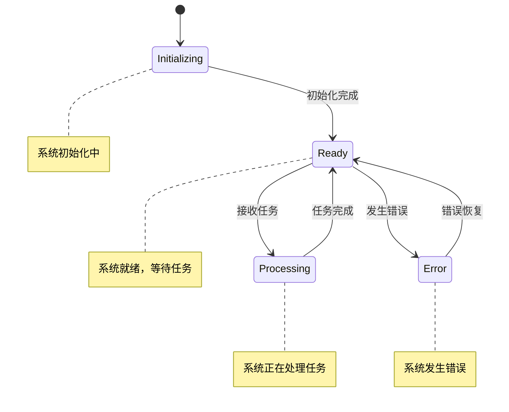

# UML图

## 1. 类图

### 1.1 核心类图



### 1.2 工具类图



## 2. 序列图

### 2.1 任务处理序列图



### 2.2 MCP工具执行序列图



## 3. 状态图

### 3.1 任务状态图



### 3.2 系统状态图



## 4. 活动图

### 4.1 任务处理活动图

```mermaid
flowchart TD
    A[开始] --> B[接收用户需求]
    B --> C[任务分解]
    C --> D[创建Agent和任务]
    D --> E[执行任务]
    
    E --> F{任务类型}
    F -->|工具操作| G[调用MCP工具]
    F -->|AI生成| H[调用大模型生成]
    
    G --> I[保存结果到数据库]
    H --> I
    
    I --> J{是否还有任务}
    J -->|是| E
    J -->|否| K[整合结果]
    
    K --> L[返回给用户]
    L --> M[结束]