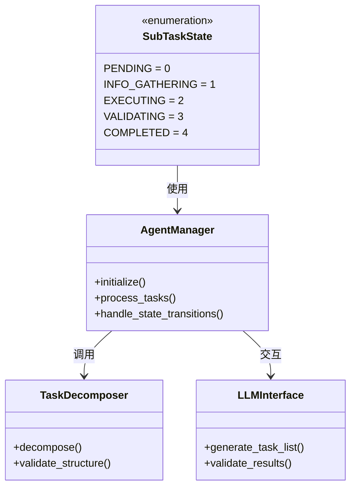

# Agent流程管理模块UML图

## 类图


## 序列图
```mermaid
sequenceDiagram
    participant User
    participant AgentManager
    participant LLMInterface
    participant TaskDecomposer

    User->>AgentManager: 提交自然语言需求
    AgentManager->>LLMInterface: 请求任务分解
    LLMInterface->>LLMInterface: LLM处理需求分析
    LLMInterface-->>AgentManager: 返回结构化任务清单
    AgentManager->>User: 请求子任务确认/重组
    User->>AgentManager: 确认子任务顺序
    AgentManager->>TaskDecomposer: 初始化任务执行
    loop 每个子任务
        TaskDecomposer->>LLMInterface: 执行子任务
        LLMInterface->>LLMInterface: 需求补充判断
        alt 需要补充信息
            LLMInterface-->>AgentManager: 请求信息补充
            AgentManager-->>User: 获取补充信息
        end
        TaskDecomposer->>TaskDecomposer: 执行工具操作或AI生成
        TaskDecomposer->>AgentManager: 返回子任务结果
    end