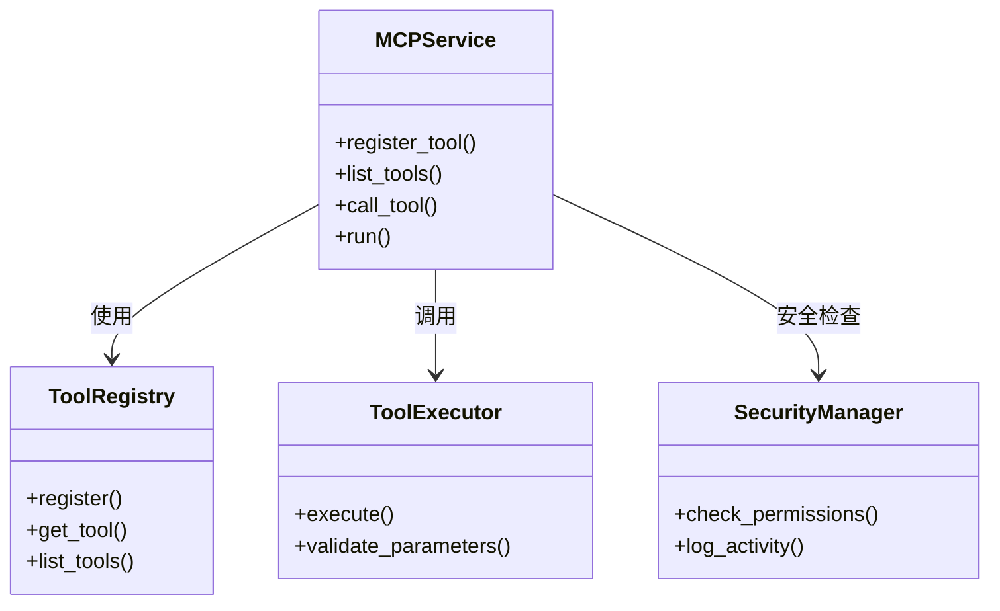

# MCP工具管理模块UML图

## 类图


## 序列图
```mermaid
sequenceDiagram
    participant LLM
    participant Agent
    participant MCPService
    participant Tool

    LLM->>Agent: 请求工具调用
    Agent->>MCPService: 调用工具
    MCPService->>ToolRegistry: 查找工具
    ToolRegistry-->>MCPService: 返回工具信息
    MCPService->>SecurityManager: 检查权限
    SecurityManager-->>MCPService: 权限确认
    MCPService->>ToolExecutor: 执行工具
    ToolExecutor->>Tool: 调用具体工具
    Tool-->>ToolExecutor: 返回结果
    ToolExecutor-->>MCPService: 返回结果
    MCPService-->>Agent: 返回结构化结果