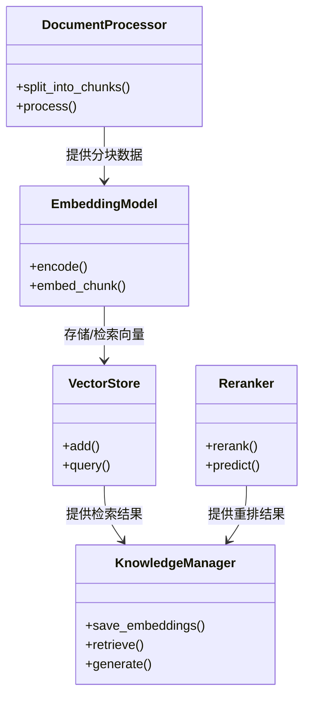

# RAG知识管理模块UML图

## 类图


## 序列图
```mermaid
sequenceDiagram
    participant User
    participant KnowledgeManager
    participant DocumentProcessor
    participant EmbeddingModel
    participant VectorStore
    participant Reranker
    participant LLM

    User->>KnowledgeManager: 提交查询请求
    KnowledgeManager->>EmbeddingModel: 初始化模型
    KnowledgeManager->>DocumentProcessor: 分块文档
    DocumentProcessor-->>KnowledgeManager: 返回分块
    KnowledgeManager->>EmbeddingModel: 生成嵌入向量
    KnowledgeManager->>VectorStore: 存储向量
    KnowledgeManager->>VectorStore: 执行相似性检索
    VectorStore-->>KnowledgeManager: 返回检索结果
    KnowledgeManager->>Reranker: 执行结果重排序
    Reranker-->>KnowledgeManager: 返回优化结果
    KnowledgeManager->>LLM: 生成最终回答
    LLM-->>User: 返回最终答案