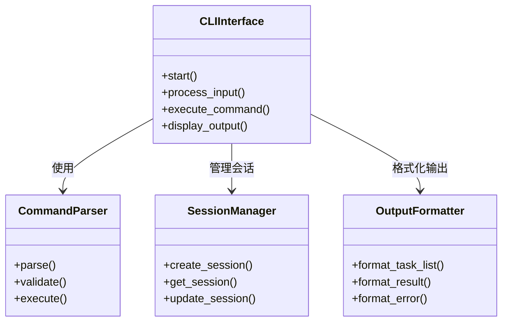

# 命令行交互模块UML图

## 类图


## 序列图
```mermaid
sequenceDiagram
    participant User
    participant CLIInterface
    participant CommandParser
    participant SessionManager
    participant AgentManager
    participant OutputFormatter

    loop 用户交互循环
        User->>CLIInterface: 输入自然语言或命令
        CLIInterface->>CommandParser: 解析输入
        alt 输入是系统命令
            CommandParser->>SessionManager: 执行命令操作
            SessionManager-->>CLIInterface: 返回结果
        else 输入是自然语言需求
            CLIInterface->>AgentManager: 提交需求
            AgentManager->>AgentManager: 任务分解与执行
            AgentManager-->>CLIInterface: 返回结果
        end
        CLIInterface->>OutputFormatter: 格式化输出
        OutputFormatter-->>User: 显示结果
    end