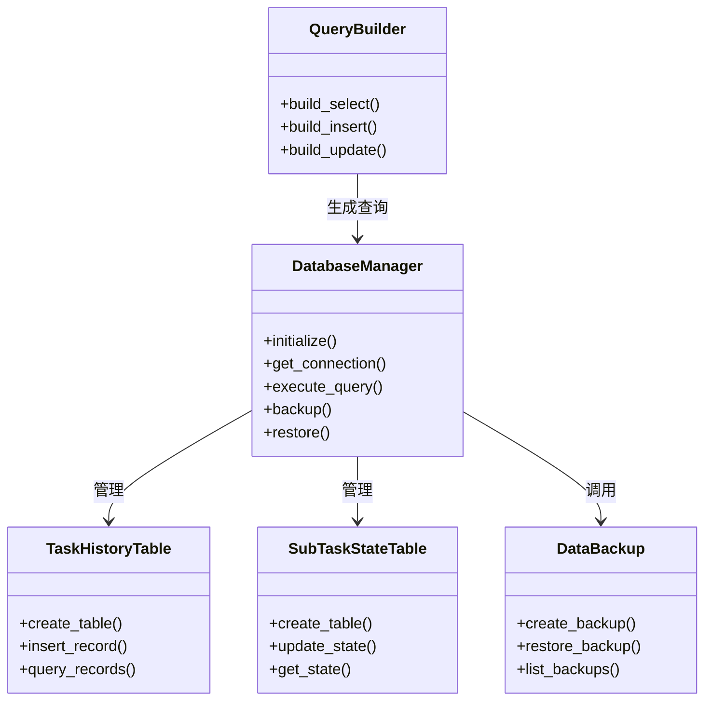

# 本地数据管理模块UML图

## 类图


## 序列图
```mermaid
sequenceDiagram
    participant TaskExecutor
    participant DatabaseManager
    participant TaskHistoryTable
    participant SubTaskStateTable

    TaskExecutor->>DatabaseManager: 开始事务
    DatabaseManager->>TaskHistoryTable: 插入任务记录
    TaskHistoryTable-->>DatabaseManager: 返回结果
    DatabaseManager->>SubTaskStateTable: 更新子任务状态
    SubTaskStateTable-->>DatabaseManager: 返回结果
    TaskExecutor->>DatabaseManager: 提交事务
    alt 数据量达到阈值
        DatabaseManager->>DataBackup: 执行数据归档
    end