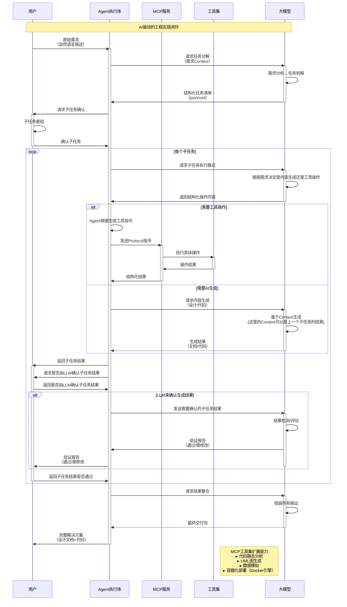

# ai agent flow

## requirement

1. 根据下面的流程图 生成出合适的python程序
    * 架构清晰, 包含如下模块:

        _Agent 管理
        _MCP 注册和管理, 生成file管理的mcp工具作为示例
        _大模型交互接口
        _本地数据管理
        _命令行交互
        _其他

    * 逻辑清晰
    * 可读性强
    * 命令行交互即可, 但是输入输出要完备

2. 使用下面的组件作为基础架构:

    * 使用openai的兼容api通大模型进行对话, 可以修改base_url和模型名还有api_key
    * 使用crewAI 作为agent管理
    * 使用FastMCP 来管理mcp工具
    * 使用sqlLite3作为本地数据管理

3. 根据生成的脚本生成合适的文档, 文档路径写到doc文件夹下
    * 详细设计文档
    * 系统架构图
    * UML图

4. 请根据需求先计划好作业的步骤

## flow

