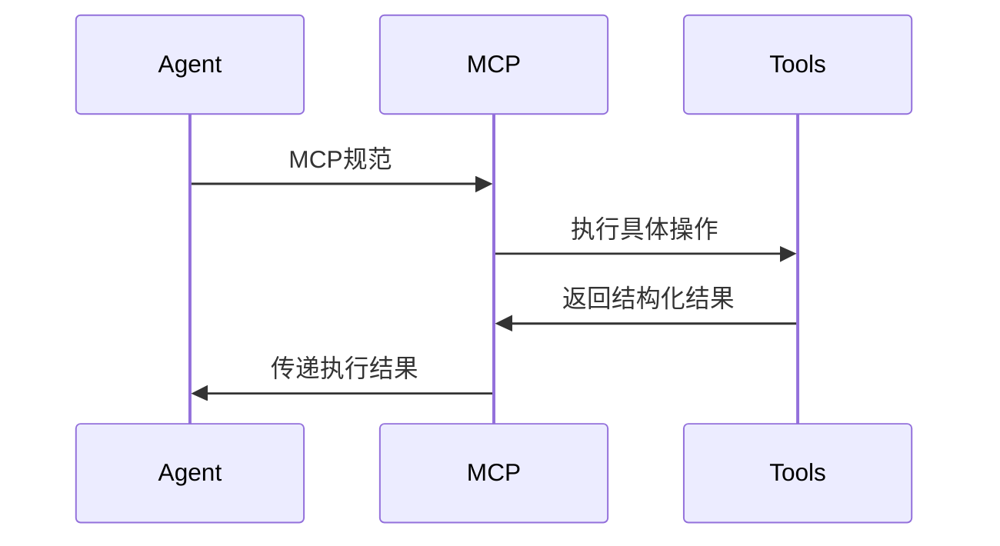

# ai agent flow

## requirement

### 1. 模块架构
需实现以下核心模块：
- **Agent管理模块**
  - 支持CrewAI标准接口
  - 提供Agent生命周期管理
  - 实现任务队列调度机制

- **MCP服务模块**
  - 集成FastMCP SDK
  - 实现文件管理工具（示例）
  - 支持工具扩展接口

- **LLM交互模块**
  - 支持OpenAI兼容API
  - 可配置base_url/模型名/API_KEY
  - 实现请求重试机制（3次+指数退避）

- **数据管理模块**
  - 基于SQLite3实现
  - 支持任务状态持久化
  - 提供数据访问接口

### 2. 交互规范
#### 模块间通信


#### 异常处理流程
1. 网络异常：自动重试3次，记录错误日志
2. 文件访问异常：返回错误码403，提示用户检查权限
3. LLM响应超时：中断当前任务，返回错误码504
4. 数据库连接失败：进入维护模式，只读状态

### 3. 文档规范
#### 自动生成要求
- 使用Sphinx生成API文档
- PlantUML生成架构图（存储/doc/uml目录）
- 每次代码提交自动生成变更文档

#### 文档结构
```bash
doc/
├── architecture.md    # 系统架构说明
├── api_spec.md        # 接口规范
├── uml/               # UML图示
│   ├── sequence.puml
│   ├── component.puml
└── changelog.md       # 版本变更记录
```

### 4. 开发规范
1. 代码风格：PEP8 + Google Python Style
2. 单元测试：pytest框架，覆盖率≥85%
3. 日志系统：使用logging模块，分级记录
4. 安全要求：敏感数据加密存储

## flow

[保留原始mermaid流程图内容]